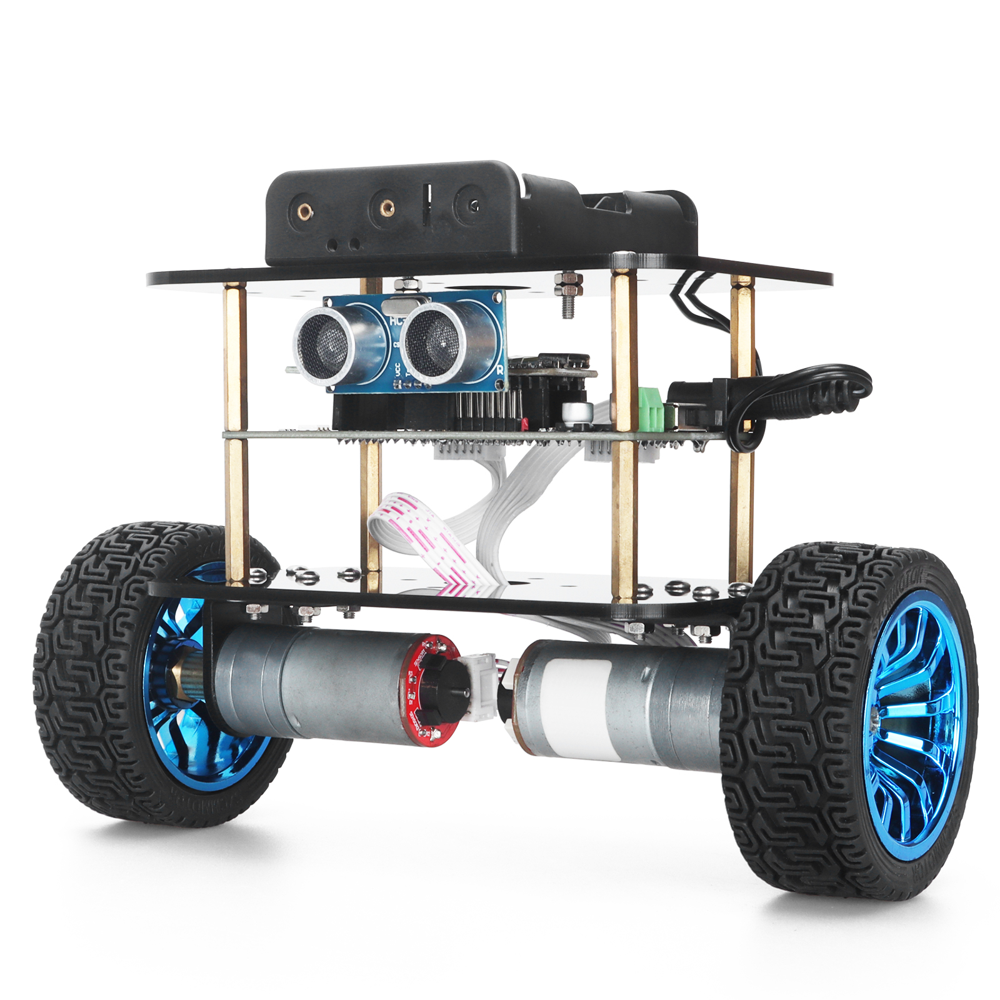

# Balancing robot
This is a C project developed to control a balancing robot car. This project uses FreeRTOS and a STM32 Bluepill.



# Build PC Project

```
$ mkdir build

$ cd build

$ cmake ..

$ make
```
# Building Tests

Follow the same steps as above changing the last command by:

```
$ make unit_tests
```