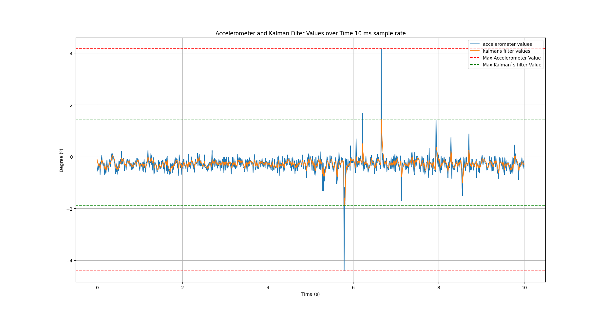
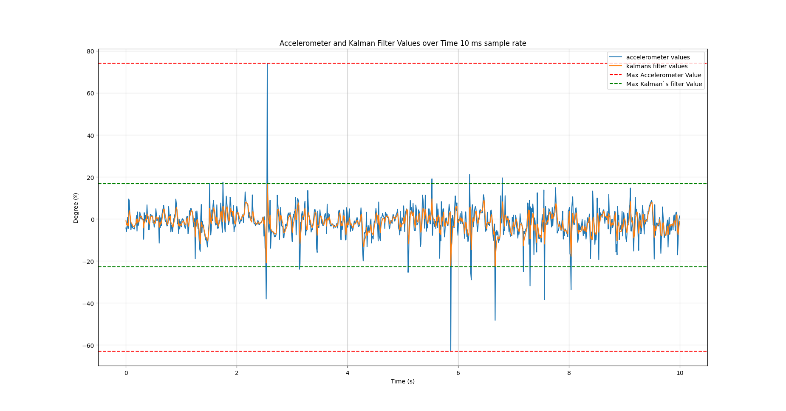

# Balancing robot
This is a C project developed to control a balancing robot car. This project uses FreeRTOS and a STM32 Bluepill. 
By the end, the robot will provide a serial interface with a protocol to receive movement commands
allowing a NVIDIA Jetson to interface with it and process images of the surroundings. 


# Setup Bluepill environment

- Clone stm32f103c8t6 fork with submodules

```
$ git clone --recurse-submodules https://github.com/machadothi/stm32f103c8t6.git
```

- Edit `Project.mk` file and the following line inside of with the correct 
FreeRTOS version:

```
FREERTOS? = FreeRTOSv10.0.1
```

- Download the cross-compiler from `https://developer.arm.com/downloads/-/arm-gnu-toolchain-downloads`
and install it.

```
# cd /opt

# tar xjf ~myuserid/Downloads/gcc-arm-none-eabi-6-2017-q2-update-mac.tar.bz2

# mv gcc-arm-none-eabi-6-2017-q2-update gcc-arm

$ export PATH="/opt/gcc-arm/bin:$PATH"
```
 
 Check if it's successfully installed with

```
$ arm-none-eabi-gcc --version
```
# Build Project
```
$ cd stm32f103c8t6/rtos/balancing-robot/src

$ make
```
# Flash into STM32

```
$ make flash
```
# Kalman's Filter Results
A Kalman filter was implemented to filter the IMU acquisition data.

## With a steady system


## With perturbance

