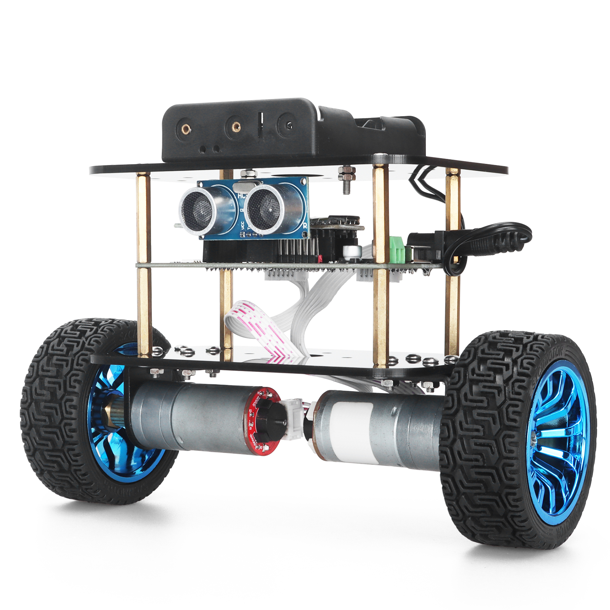
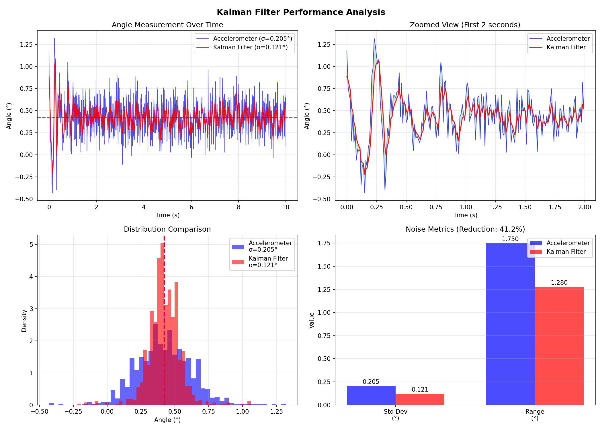
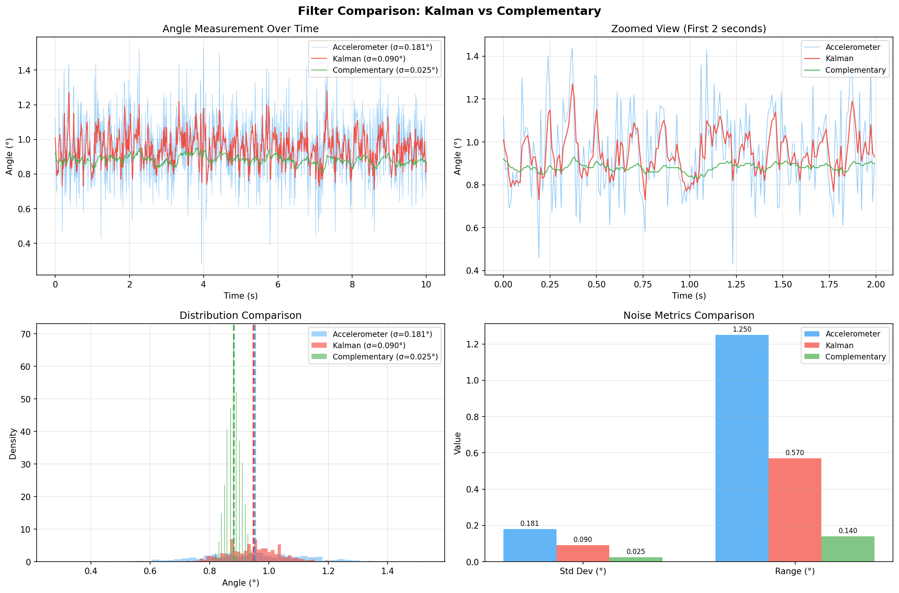

# Balancing Robot

A self-balancing robot project using STM32 Blue Pill (STM32F103C8T6) with FreeRTOS. The robot uses an MPU6050 IMU with sensor fusion filters for stable angle estimation.



## Features

- **FreeRTOS** - Real-time operating system for task management
- **MPU6050 IMU** - 6-axis accelerometer and gyroscope
- **Dual Filter Implementation** - Both Kalman and Complementary filters available
- **TB6612 Motor Driver** - Dual H-bridge motor control
- **UART Communication** - Serial interface at 921600 baud

## Hardware

- STM32F103C8T6 (Blue Pill)
- MPU6050 IMU module
- TB6612FNG motor driver
- DC motors with encoders
- USB-Serial adapter (for debugging)

## Project Structure

```
balancing-robot/
├── src/
│   ├── main.c              # Main application
│   ├── config.h            # Centralized configuration
│   ├── communication/      # I2C and UART drivers
│   ├── filter/             # Kalman and Complementary filters
│   ├── imu/                # MPU6050 driver and IMU interface
│   ├── motor/              # Motor control
│   ├── robot/              # Robot task and control logic
│   ├── log/                # Logging utilities
│   └── rtos/               # FreeRTOS source files
├── test/
│   └── statistics.py       # Filter analysis script
├── img/                    # Images and plots
└── README.md
```

## Building

See [BUILD.md](BUILD.md) for detailed build instructions.

### Quick Start

```bash
# Clone the repository
git clone --recurse-submodules https://github.com/machadothi/stm32f103c8t6.git
cd stm32f103c8t6/rtos/balancing-robot/src

# Build
make

# Flash to STM32
make flash
```

## Kalman Filter Performance

A 1D Kalman filter is implemented to fuse accelerometer and gyroscope data for stable angle estimation. The filter significantly reduces measurement noise while maintaining fast response to actual movement.

### Filter Analysis



The analysis shows:
- **Time series comparison** - Raw accelerometer vs filtered Kalman output
- **Distribution comparison** - Tighter spread of Kalman filtered values
- **Noise reduction metrics** - Standard deviation and range improvements

## Sensor Fusion Filters

This project implements two sensor fusion filters for angle estimation: **Kalman Filter** and **Complementary Filter**.

### Why Two Filters?

Initially, the Kalman filter was implemented as the primary sensor fusion algorithm. While the Kalman filter is mathematically optimal under certain conditions, real-world testing revealed that the **Complementary filter provided better results** for this specific application.

### Filter Comparison



The comparison graph shows both filters running simultaneously on the same IMU data. Key observations:

- **Complementary Filter** - Faster response, smoother output, less computational overhead
- **Kalman Filter** - More complex, requires tuning of Q and R parameters

The Complementary filter's simplicity and effectiveness made it the preferred choice for the balancing robot's real-time control loop.

### How the Filters Work

#### Kalman Filter
The Kalman filter uses a predict-update cycle:
1. **Predict** - Estimate angle using gyroscope integration
2. **Update** - Correct prediction using accelerometer measurement
3. Parameters: `Q_angle` (process noise), `R_measure` (measurement noise)

#### Complementary Filter
The Complementary filter combines high-pass (gyro) and low-pass (accel) filtering:
```
angle = α × (angle + gyro × dt) + (1 - α) × accel_angle
```
- `α = 0.96` - Trust 96% gyroscope, 4% accelerometer
- Simple, computationally efficient, and robust

### Switching Between Filters

In `src/config.h`, both filters can be configured. The robot task in `src/robot/robot.c` can easily switch between filters for comparison or choose the preferred one for production use.

### Running the Analysis

```bash
cd test/
python3 statistics.py
```

This will collect 1000 samples from the IMU and generate the performance analysis plot.

## Configuration

All tunable parameters are centralized in `src/config.h`:

### Filter Parameters

| Parameter | Value | Description |
|-----------|-------|-------------|
| `KALMAN_Q_ANGLE` | 0.1 | Kalman process noise covariance |
| `KALMAN_R_MEASURE` | 0.5 | Kalman measurement noise covariance |
| `COMPLEMENTARY_ALPHA` | 0.96 | Complementary filter weight (gyro trust) |
| `SAMPLE_RATE_HZ` | 100 | IMU sampling frequency |

### Gyro Calibration

In `src/imu/mpu6050.h`:
- `GYRO_CONST_ERROR_MEAS` - Set to negative of gyro reading when stationary

## License

See [LICENSE](LICENSE) for details.
