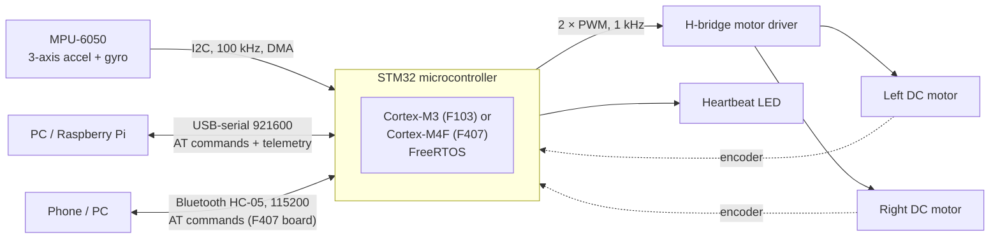
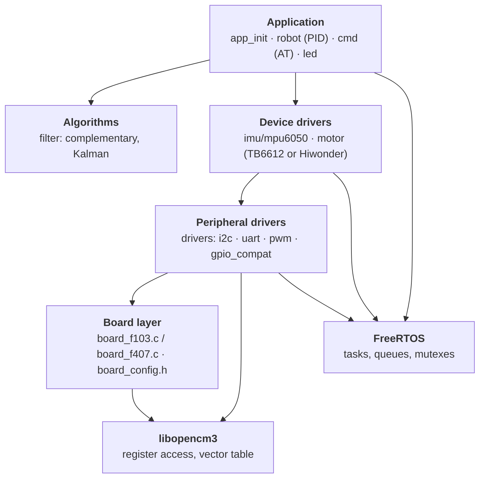
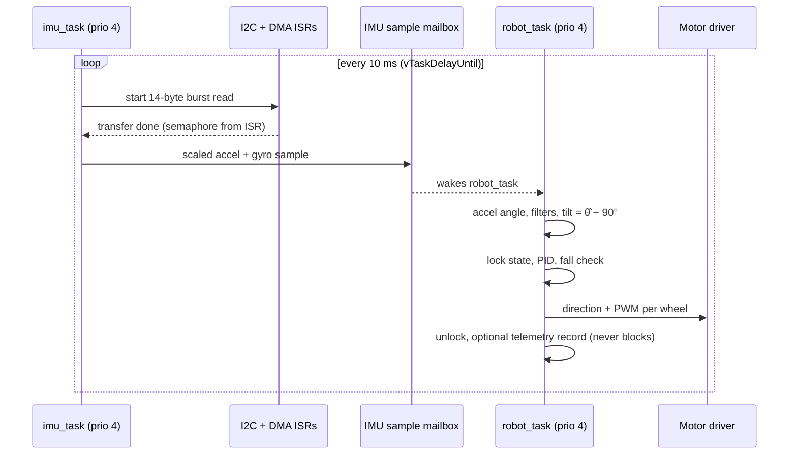

# 01 — System Overview

What the robot is made of, how the firmware is layered, and how one sensor
sample becomes a motor command. Later chapters zoom into each block.

## Where in the code

| What | Where |
|------|-------|
| Entry point | [`main()`](../src/main.c#L26) |
| Hardware and task start-up | [`app_hardware_init()`](../src/app/app_init.c#L20), [`app_tasks_init()`](../src/app/app_init.c#L32) |
| Per-board peripherals | [src/board/f103/board_config.h](../src/board/f103/board_config.h), [src/board/f407/board_config.h](../src/board/f407/board_config.h) |
| Sensing | [`imu_task()`](../src/imu/imu.c#L41) |
| Control | [`robot_task()`](../src/robot/robot.c#L169) |

## Hardware



The firmware builds for two boards from the same tree:

| | Blue Pill | Hiwonder ROS Robot Control Board |
|---|---|---|
| MCU | STM32F103C8T6, Cortex-M3, 72 MHz | STM32F407VET6, Cortex-M4F with FPU, 168 MHz |
| Memory | 64 K flash / 20 K RAM | 512 K flash / 128 K RAM (+64 K CCM) |
| IMU bus | I2C1 on PB6/PB7, external module | I2C2 on PB10/PB11, on-board |
| Motor driver | External TB6612FNG: direction pins + 1 PWM per motor | On-board H-bridges: 2 PWM inputs per motor |
| Encoders | Rising edges on EXTI (count only, no direction) | Quadrature, counted by hardware timers |
| Console | USART2 on PA2/PA3 via a USB-serial adapter | USART3 (PD8/PD9) via the on-board Type-C USB-serial port |
| FreeRTOS | V10.4.3 LTS submodule, `ARM_CM3` port | V10.4.3 LTS submodule, `ARM_CM4F` port |
| Wiring | [pin-connections-f103](hardware/pin-connections-f103.md) | [pin-connections-f407](hardware/pin-connections-f407.md) |

## Firmware layers



- **Board layer.** Everything that differs between boards: clock tree, LED,
  and a `board_config.h` naming the UART, I2C, DMA streams and interrupt
  handlers each driver should use ([04](04-drivers-and-board-layer.md)).
- **Peripheral drivers.** Chip-level drivers written once for both STM32
  families; `#if defined(STM32F1)` covers the few API differences.
- **Device drivers.** The MPU-6050 register protocol and the motor drivers.
  The motor driver is a whole file per board, because the H-bridges differ.
- **Algorithms.** Plain C, no hardware access; testable on a PC.
- **Application.** Task wiring, the balance loop and the AT console.

## From sample to motor command



1. [`imu_task`](../src/imu/imu.c#L41) wakes on a fixed 10 ms schedule and
   starts a DMA read of all 14 sensor bytes; it sleeps on a semaphore until the
   DMA interrupt signals completion.
2. It converts raw counts to g and °/s and overwrites the single-slot
   sample mailbox, so the controller always sees the newest sample.
3. [`robot_task`](../src/robot/robot.c#L169) blocks in `imu_wait_sample()`, so its
   rate is set by the IMU task. It computes the accelerometer angle, runs both
   filters ([07](07-sensor-fusion.md)) and picks one.
4. Holding the state mutex, it runs the PID ([08](08-pid-implementation.md)),
   applies the safety cut-off and writes the motor commands.
5. Meanwhile the UART RX task parses AT commands; commands that touch the
   robot state take the same mutex ([03](03-boot-and-rtos.md)).

## Repository map

| Path | Contents |
|------|----------|
| `src/app/` | Hardware init and task creation |
| `src/board/` | Board support: clock, LED, `f103/` and `f407/` configuration headers |
| `src/drivers/` | I2C (polling/IT/DMA), UART, PWM, GPIO compatibility helpers |
| `src/imu/` | IMU abstraction and MPU-6050 driver |
| `src/filter/` | Complementary and Kalman filters |
| `src/robot/` | Balance control task and AT command handlers |
| `src/motor/` | `motor.c` (Blue Pill, TB6612), `motor_hiwonder.c` (F407 board) |
| `src/cmd/` | AT command parser |
| `src/fault/` | Hard fault, stack overflow and malloc failure handlers |
| `src/telemetry/` | USB telemetry logger |
| `src/util/` | Shared helpers (fixed-point formatting) |
| `src/rtos_glue/` | libopencm3 ↔ FreeRTOS handler glue |
| `src/*.ld` | Linker scripts per MCU |
| `cmake/` | Toolchain file and per-board CMake settings |
| `lib/` | libopencm3 and FreeRTOS-Kernel submodules |
| `test/` | Hardware tests over the AT console ([test/README.md](../test/README.md)) and `filter_comparison.py` |
| `vendor/hiwonder/` | Original firmware image of the F407 board |
| `docs/` | This book |

## Limitations and next steps

- One balance loop on tilt only; no velocity or position control
  ([06](06-control-theory.md)).
- Encoders are wired and readable but not used by the controller yet.

## Adding a module

A module is a directory under `src/` that exports one descriptor
([module.h](../src/app/module.h)); nothing central is edited:

```c
/* src/buzzer/buzzer.c */
APP_MODULE(buzzer_module) = {
    .name = "BUZZER",
    .init = buzzer_init,            /* before the scheduler, may be NULL */
    .task = buzzer_task,            /* may be NULL */
    .stack = 128,                   /* words */
    .priority = APP_PRIORITY_BACKGROUND,
};
```

```cmake
# CMakeLists.txt, next to the other features
robot_feature(BUZZER OFF "Beep on falls" SOURCES ${SRC_DIR}/buzzer/buzzer.c)
```

```ini
# prj.conf
BUZZER=ON
```

`APP_MODULE()` places the descriptor in the section `.app_modules.buzzer_module`.
Both linker scripts gather those sections, sorted by name, into one array
between `__app_modules_start` and `__app_modules_end`, with `KEEP` so
`--gc-sections` does not discard them. A module is in the table exactly when its
`.c` file is built, so there is no list to maintain; `arm-none-eabi-nm -n` on the
ELF shows the `*_module` symbols in table order. [`app_hardware_init()`](../src/app/app_init.c#L20)
runs all `init` functions, then [`app_tasks_init()`](../src/app/app_init.c#L32)
creates all tasks, so a module's queues and locks exist before any task runs.
Commands are added the same way, from the module's `init`
([10](10-at-commands.md#adding-a-command)).
