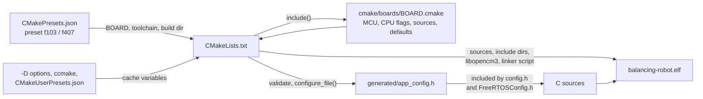

# 02 — Build and Configuration

Toolchain setup, how the CMake presets, board files and build options fit
together, flashing, and generating the API reference. All dependencies are git
submodules.

## Where in the code

| What | Where |
|------|-------|
| Top-level build, option validation | [CMakeLists.txt](../CMakeLists.txt) |
| Per-board settings | [cmake/boards/](../cmake/boards) |
| Presets | [CMakePresets.json](../CMakePresets.json) |
| Generated header template | [src/app_config.h.in](../src/app_config.h.in) |
| Toolchain file | [cmake/arm-none-eabi.cmake](../cmake/arm-none-eabi.cmake) |
| Doxygen template | [doxygen/Doxyfile.in](doxygen/Doxyfile.in) |

## Quick Start

The easiest way to build is using the setup script:

```bash
git clone https://github.com/machadothi/balancing-robot.git
cd balancing-robot
./scripts/setup.sh
```

This will:
1. Check for required tools
2. Clone libopencm3 and FreeRTOS-Kernel as submodules
3. Build libopencm3 for STM32F1 and STM32F4
4. Configure and build the `f103` preset (`BOARD=f407 ./scripts/setup.sh` for the F407 board)

## Prerequisites

### ARM Toolchain

**Ubuntu/Debian:**
```bash
sudo apt install gcc-arm-none-eabi cmake make git
```

**Arch Linux:**
```bash
sudo pacman -S arm-none-eabi-gcc arm-none-eabi-newlib cmake make git
```

**Manual Installation:**
Download from [ARM Developer](https://developer.arm.com/downloads/-/arm-gnu-toolchain-downloads):
```bash
cd /opt
sudo tar xjf ~/Downloads/gcc-arm-none-eabi-*-linux.tar.bz2
sudo mv gcc-arm-none-eabi-* gcc-arm
export PATH="/opt/gcc-arm/bin:$PATH"
```

Verify:
```bash
arm-none-eabi-gcc --version
```

### ST-Link Tools (for flashing)

```bash
# Ubuntu/Debian
sudo apt install stlink-tools

# Or build from source
git clone https://github.com/stlink-org/stlink.git
cd stlink && cmake . && make && sudo make install
```

## Manual Build

If you prefer to build manually:

### 1. Clone with Submodules

```bash
git clone --recurse-submodules https://github.com/machadothi/balancing-robot.git
cd balancing-robot
```

Or if already cloned:
```bash
git submodule update --init --recursive
```

### 2. Build libopencm3

```bash
cd lib/libopencm3
make TARGETS="stm32/f1 stm32/f4" -j$(nproc)
cd ../..
```

### 3. Build with CMake

Each board has a CMake preset with its own build directory:

| Preset | Board | Build directory |
|--------|-------|-----------------|
| `f103` | Blue Pill (STM32F103C8T6) | `build-f103/` |
| `f407` | Hiwonder ROS Robot Control Board (STM32F407VET6) | `build-f407/` |

```bash
cmake --preset f407
cmake --build --preset f407
```

Without presets:
```bash
cmake -B build-f407 -DBOARD=f407 -DCMAKE_TOOLCHAIN_FILE=cmake/arm-none-eabi.cmake
cmake --build build-f407
```

Board peripheral assignments (console UART, I2C bus, DMA streams) are in
`src/board/<board>/board_config.h`. On the F407 board the console is the
Type-C USB-serial port (USART1), and the robot's motors plug into ports M1
and M2; change `BOARD_MOTOR1_PORT` / `BOARD_MOTOR2_PORT` there to use others.

## How configuration flows



1. **The preset** selects the board, the toolchain file and a build directory
   per board.
2. **The board file** (`cmake/boards/<board>.cmake`) sets everything
   MCU-specific: CPU flags, libopencm3 library, linker script, FreeRTOS kernel
   and port, clock frequency, board and motor sources, and per-board option
   defaults.
3. **Options** are declared after the board file, so board defaults apply, and
   are then validated. Configuration stops with an error for an unknown board or
   filter, a non-integer value, or an `IMU_SAMPLE_RATE_MS` that is not a whole
   number of RTOS ticks.
4. **`configure_file()`** writes the option values to
   `build-<preset>/generated/app_config.h`. Firmware code never reads CMake
   variables directly; it includes `config.h`, which includes this header.

Because the header is generated per build directory, the two boards can be
built side by side with different options.

## Build Options

Options are CMake cache variables. They are written to
`build-<preset>/generated/app_config.h`, which `config.h` includes.

| Option | Default | Description |
|--------|---------|-------------|
| `BOARD` | `f103` | Target board: `f103` or `f407` |
| `APP_BLINK_ONLY` | `OFF` | Only run the LED heartbeat task |
| `UART_BAUDRATE` | `921600` | UART baud rate |
| `IMU_SAMPLE_RATE_MS` | `10` | IMU and control loop period (ms); must be a whole number of ticks |
| `ATTITUDE_FILTER` | `complementary` | Tilt estimator used by the controller: `complementary` or `kalman` ([07](07-sensor-fusion.md)) |
| `FREERTOS_TICK_RATE_HZ` | `1000` | FreeRTOS tick rate |
| `FREERTOS_TOTAL_HEAP_SIZE` | `10240` (f103), `32768` (f407) | FreeRTOS heap (bytes) |
| `UART_PRINTF_ENABLED` | `ON` | `uart_printf` support |
| `UART_ECHO_ENABLED` | `ON` | Echo received characters |
| `I2C_DMA_ENABLED` | `ON` | I2C DMA transfers (required for IMU) |
| `I2C_BUS_RECOVERY` | `ON` | I2C bus recovery |
| `AT_CMD_HELP_ENABLED` | `OFF` | `AT+HELP` command |
| `AT_CMD_ALL_QUERY` | `OFF` | `AT+ALL?` bulk query |
| `AT_CMD_PID_TOGGLE` | `ON` | `AT+PIDON/PIDOFF/PID` commands |
| `LOG_ENABLED` | `OFF` | Logging over UART |
| `FAULT_HANDLERS_VERBOSE` | `ON` | Print fault messages over UART |
| `WATCHDOG_ENABLED` | `ON` | Independent watchdog (500 ms) refreshed by the control task |

With `APP_BLINK_ONLY=ON` the driver options (everything from
`UART_PRINTF_ENABLED` down) are forced `OFF`.

Ways to change options:

- On the command line: `cmake --preset f103 -DUART_BAUDRATE=115200`
- Interactively: `ccmake build-f103` (install with `sudo apt install cmake-curses-gui`)
- As personal presets in `CMakeUserPresets.json`, which is gitignored:

```json
{
  "version": 3,
  "configurePresets": [
    { "name": "f103-dev", "inherits": "f103", "cacheVariables": { "UART_BAUDRATE": "115200" } }
  ],
  "buildPresets": [
    { "name": "f103-dev", "configurePreset": "f103-dev" }
  ]
}
```

A board's defaults only apply to a new build directory. To switch boards,
use the other preset instead of changing `BOARD` in an existing directory.

## Build Outputs

After building, these files are in `build-<preset>/`:
- `balancing-robot.elf` - ELF executable (for debugging)
- `balancing-robot.bin` - Binary for flashing
- `balancing-robot.hex` - Intel HEX format
- `balancing-robot.map` - Memory map

## Flashing

### ST-Link (SWD)

Connect your ST-Link programmer (on the F407 board: SWDIO = PA13, SWCLK = PA14) and run:

```bash
cmake --build --preset f103 --target flash
```

Or manually:
```bash
st-flash write build-f103/balancing-robot.bin 0x8000000
```

### USB serial bootloader (F407 board)

The Hiwonder board can be flashed through its Type-C USB-serial port (UART1),
which uses DTR/RTS to reset into the STM32 ROM bootloader. This requires
`stm32flash` (`sudo apt install stm32flash`):

```bash
cmake --build --preset f407 --target flash-serial
```

The port and boot sequence are the `SERIAL_PORT` (default `/dev/ttyUSB0`) and
`SERIAL_BOOT_SEQUENCE` cache variables. The default sequence has not been
tested on the board yet.

## Serial Monitor

The project outputs debug data at 921600 baud via UART2 (PA2) on the Blue
Pill, or the Type-C USB-serial port (USART1) on the F407 board:

```bash
picocom -b 921600 /dev/ttyUSB0
```

## Clean Builds

```bash
# Clean CMake builds
rm -rf build-f103 build-f407

# Clean and rebuild everything
./scripts/setup.sh --clean

# Just rebuild libopencm3 and project
./scripts/setup.sh --rebuild
```

## API Documentation (Doxygen)

The `docs` target generates an HTML API reference from the source comments,
with call graphs when Graphviz is installed:

```bash
sudo apt install doxygen graphviz
cmake --preset f103        # re-run configure after installing doxygen
cmake --build --preset f103 --target docs
xdg-open build-f103/docs/html/index.html
```

The target only exists when CMake finds `doxygen`. The configuration template
is [doxygen/Doxyfile.in](doxygen/Doxyfile.in); it documents `src/` (without the
vendored FreeRTOS) using the selected board's include paths and MCU family
define.

## Project Structure

See the repository map in [01 — System Overview](01-system-overview.md#repository-map).

## Troubleshooting

### Build or Flash Errors

- Run `./scripts/setup.sh --clean` to start fresh
- Check ST-Link connection
- Verify device is detected: `st-info --probe`
- Try resetting the board while flashing

### No Serial Output

- Check the console wiring: TX is PA2 on the Blue Pill; the F407 board uses its Type-C port
- Verify baud rate matches (921600)
- Ensure USB-Serial adapter is working: `ls /dev/ttyUSB*`
