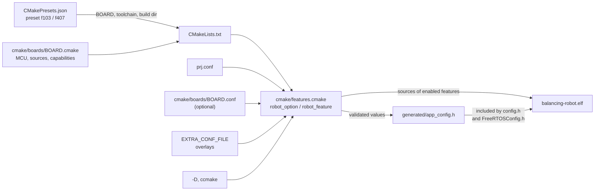

# 02 — Build and Configuration

Toolchain setup, how the CMake presets, board files and build options fit
together, flashing, and generating the API reference. All dependencies are git
submodules.

## Where in the code

| What | Where |
|------|-------|
| Top-level build, option and feature declarations | [CMakeLists.txt](../CMakeLists.txt) |
| Configuration values | [prj.conf](../prj.conf) |
| `.conf` parser, option and feature registry | [cmake/features.cmake](../cmake/features.cmake) |
| Per-board settings | [cmake/boards/](../cmake/boards) |
| Presets | [CMakePresets.json](../CMakePresets.json) |
| Generated header template | [src/app_config.h.in](../src/app_config.h.in) |
| Toolchain file | [cmake/arm-none-eabi.cmake](../cmake/arm-none-eabi.cmake) |
| Doxygen template | [doxygen/Doxyfile.in](doxygen/Doxyfile.in) |

## Quick Start

The easiest way to build is using the setup script:

```bash
git clone https://github.com/machadothi/balancing-robot.git
cd balancing-robot
./scripts/setup.sh
```

This will:
1. Check for required tools
2. Clone libopencm3 and FreeRTOS-Kernel as submodules
3. Build libopencm3 for STM32F1 and STM32F4
4. Configure and build the `f103` preset (`BOARD=f407 ./scripts/setup.sh` for the F407 board)

## Prerequisites

### ARM Toolchain

**Ubuntu/Debian:**
```bash
sudo apt install gcc-arm-none-eabi cmake make git
```

**Arch Linux:**
```bash
sudo pacman -S arm-none-eabi-gcc arm-none-eabi-newlib cmake make git
```

**Manual Installation:**
Download from [ARM Developer](https://developer.arm.com/downloads/-/arm-gnu-toolchain-downloads):
```bash
cd /opt
sudo tar xjf ~/Downloads/gcc-arm-none-eabi-*-linux.tar.bz2
sudo mv gcc-arm-none-eabi-* gcc-arm
export PATH="/opt/gcc-arm/bin:$PATH"
```

Verify:
```bash
arm-none-eabi-gcc --version
```

### ST-Link Tools (for flashing)

```bash
# Ubuntu/Debian
sudo apt install stlink-tools

# Or build from source
git clone https://github.com/stlink-org/stlink.git
cd stlink && cmake . && make && sudo make install
```

## Manual Build

If you prefer to build manually:

### 1. Clone with Submodules

```bash
git clone --recurse-submodules https://github.com/machadothi/balancing-robot.git
cd balancing-robot
```

Or if already cloned:
```bash
git submodule update --init --recursive
```

### 2. Build libopencm3

```bash
cd lib/libopencm3
make TARGETS="stm32/f1 stm32/f4" -j$(nproc)
cd ../..
```

### 3. Build with CMake

Each board has a CMake preset with its own build directory:

| Preset | Board | Build directory |
|--------|-------|-----------------|
| `f103` | Blue Pill (STM32F103C8T6) | `build-f103/` |
| `f407` | Hiwonder ROS Robot Control Board (STM32F407VET6) | `build-f407/` |

```bash
cmake --preset f407
cmake --build --preset f407
```

Without presets:
```bash
cmake -B build-f407 -DBOARD=f407 -DCMAKE_TOOLCHAIN_FILE=cmake/arm-none-eabi.cmake
cmake --build build-f407
```

Board peripheral assignments (console UART, I2C bus, DMA streams) are in
`src/board/<board>/board_config.h`. On the F407 board the console is the
Type-C USB-serial port (USART1), and the robot's motors plug into ports M1
and M2; change `BOARD_MOTOR1_PORT` / `BOARD_MOTOR2_PORT` there to use others.

## How configuration flows



1. **The preset** selects the board, the toolchain file and a build directory
   per board.
2. **The board file** (`cmake/boards/<board>.cmake`) sets everything
   MCU-specific: CPU flags, libopencm3 library, linker script, FreeRTOS port,
   clock frequency, board and motor sources, and the board's *capabilities*
   such as `BOARD_HAS_BT_UART`.
3. **The registry** in `cmake/features.cmake` reads the `.conf` files, declares
   each option and feature, checks types, choices and feature requirements, and
   collects the source files of enabled features.
4. **`generated/app_config.h`** receives every value as a macro. Firmware code
   never reads CMake variables; it includes `config.h`, which includes this
   header.

Because the header is generated per build directory, the two boards can be
built side by side with different settings.

## Build Options

Every option is declared once in `CMakeLists.txt`, with `robot_option()` for a
value or `robot_feature()` for an ON/OFF feature that can require other
features and brings its own source files. Their values live in
[prj.conf](../prj.conf), one `KEY=VALUE` per line:

```ini
CONSOLE_USB=ON
TELEMETRY=ON
ATTITUDE_FILTER=kalman
```

### Where a value comes from

| Precedence | Source | Use it for |
|------------|--------|------------|
| 1 (lowest) | Default in the declaration | — |
| 2 | `prj.conf` | Project settings, committed |
| 3 | `cmake/boards/<board>.conf` | Board-specific settings (optional file) |
| 4 | `-DEXTRA_CONF_FILE=my.conf` | Personal or experiment overlays; separate several files with `;` |
| 5 (highest) | `-D<KEY>=…` or `ccmake` | Quick one-off changes |

- Editing a `.conf` file re-runs CMake on the next build.
- A `-D` value stays in that build directory, and CMake prints a line for it on
  every configure, until you set it back to the `.conf` value or drop it with
  `cmake -U<KEY> --preset <board>`.
- Unknown keys and malformed lines are errors, so typos never pass silently.
- `BOARD` is not a `.conf` key: the preset selects it.

Example, a Bluetooth-only build of the F407 board:

```bash
echo "CONSOLE_USB=OFF" > bt-only.conf
cmake --preset f407 -DEXTRA_CONF_FILE=bt-only.conf
```

### Features

| Feature | Default | Requires | Effect |
|---------|---------|----------|--------|
| `CONSOLE_USB` | `ON` | — | AT console on the USB console; carries telemetry, banner and fault reports |
| `CONSOLE_BT` | `ON` where the board has a Bluetooth port | `BOARD_HAS_BT_UART` | AT console on the Bluetooth module (F407 board) |
| `CONSOLE_ECHO` | `ON` | `CONSOLE_USB` | Echo each command line |
| `TELEMETRY` | `ON` | `CONSOLE_USB` | `AT+STREAM` control loop logging ([10](10-at-commands.md)) |
| `AT_CMD_PID_TOGGLE` | `ON` | a console | `AT+PID`, `AT+PIDON`, `AT+PIDOFF` |
| `AT_CMD_HELP` | `OFF` | a console | `AT+HELP` |
| `AT_CMD_ALL_QUERY` | `OFF` | a console | `AT+ALL?` bulk query |
| `LOGGING` | `OFF` | `CONSOLE_USB` | Debug log messages (~300 bytes of stack) |
| `FAULT_VERBOSE` | `ON` | `CONSOLE_USB` | Print fault reports before halting |
| `WATCHDOG` | `ON` | — | Independent watchdog (500 ms) refreshed by the control task |
| `I2C_BUS_RECOVERY` | `ON` | — | Free a stuck I2C slave at start-up |
| `AUTO_ENABLE` | `OFF` | — | Start balancing once per boot, after the robot is held upright for 3 s |

- **Unmet requirements switch a feature off**, and CMake says so. Asking for it
  explicitly (a value different from its default) without its requirement is an
  error, for example `CONSOLE_BT=ON` on the Blue Pill.
- **No console needs `AUTO_ENABLE=ON`**: with both consoles off, nothing could
  send `AT+ENABLE`.
- **`APP_BLINK_ONLY=ON` switches every feature off.**
- **In C**, each feature is a macro that is always defined as 1 or 0
  (`#if TELEMETRY`), plus `CONSOLE_ANY` for "at least one console". The source
  files of a disabled feature are not compiled.

### Values

| Option | Default | Description |
|--------|---------|-------------|
| `APP_BLINK_ONLY` | `OFF` | Only run the LED heartbeat task |
| `UART_BAUDRATE` | `921600` | USB console baud rate (telemetry and AT commands) |
| `BT_BAUDRATE` | `115200` | Bluetooth console baud rate; must match the module |
| `IMU_SAMPLE_RATE_MS` | `10` | IMU and control loop period (ms); must be a whole number of ticks |
| `ATTITUDE_FILTER` | `complementary` | `complementary` or `kalman`, as macros `ATTITUDE_FILTER_COMPLEMENTARY` / `ATTITUDE_FILTER_KALMAN` ([07](07-sensor-fusion.md)) |
| `FREERTOS_TICK_RATE_HZ` | `1000` | FreeRTOS tick rate |
| `FREERTOS_TOTAL_HEAP_SIZE` | `12288` (f103), `32768` (f407) | FreeRTOS heap (bytes) |

### Adding an option or feature

1. Declare it in `CMakeLists.txt`, for example
   `robot_feature(MY_FEATURE OFF "What it does" REQUIRES CONSOLE_USB SOURCES ${SRC_DIR}/my/my_feature.c)`.
2. Add `MY_FEATURE=OFF` to `prj.conf` so it is visible there.
3. Use `#if MY_FEATURE` where the rest of the code calls into it.

Build directories created before this configuration system may keep stale
cache entries; when in doubt, delete the build directory and configure again.

## Build Outputs

After building, these files are in `build-<preset>/`:
- `balancing-robot.elf` - ELF executable (for debugging)
- `balancing-robot.bin` - Binary for flashing
- `balancing-robot.hex` - Intel HEX format
- `balancing-robot.map` - Memory map

## Flashing

### ST-Link (SWD)

Connect your ST-Link programmer (on the F407 board: SWDIO = PA13, SWCLK = PA14) and run:

```bash
cmake --build --preset f103 --target flash
```

Or manually:
```bash
st-flash write build-f103/balancing-robot.bin 0x8000000
```

### USB serial bootloader (F407 board)

The Hiwonder board can be flashed through its Type-C USB-serial port (UART1),
which uses DTR/RTS to reset into the STM32 ROM bootloader. This requires
`stm32flash` (`sudo apt install stm32flash`):

```bash
cmake --build --preset f407 --target flash-serial
```

The port and boot sequence are the `SERIAL_PORT` (default `/dev/ttyUSB0`) and
`SERIAL_BOOT_SEQUENCE` cache variables. The default sequence has not been
tested on the board yet.

## Serial Monitor

The USB console runs at `UART_BAUDRATE` (921600): USART2 (PA2/PA3) through a
USB-serial adapter on the Blue Pill, or the Type-C USB-serial port (USART1) on
the F407 board. It accepts AT commands and carries telemetry after
`AT+STREAM=1`:

```bash
picocom -b 921600 /dev/ttyUSB0
```

The F407 board also has a Bluetooth AT console on its Bluetooth header
(USART2, `BT_BAUDRATE`); wiring and module setup are in
[10 — AT Commands](10-at-commands.md#bluetooth-console-f407-board).

## Clean Builds

```bash
# Clean CMake builds
rm -rf build-f103 build-f407

# Clean and rebuild everything
./scripts/setup.sh --clean

# Just rebuild libopencm3 and project
./scripts/setup.sh --rebuild
```

## API Documentation (Doxygen)

The `docs` target generates an HTML API reference from the source comments,
with call graphs when Graphviz is installed:

```bash
sudo apt install doxygen graphviz
cmake --preset f103        # re-run configure after installing doxygen
cmake --build --preset f103 --target docs
xdg-open build-f103/docs/html/index.html
```

The target only exists when CMake finds `doxygen`. The configuration template
is [doxygen/Doxyfile.in](doxygen/Doxyfile.in); it documents `src/` using the selected board's include paths and MCU family
define.

## Project Structure

See the repository map in [01 — System Overview](01-system-overview.md#repository-map).

## Troubleshooting

### Build or Flash Errors

- Run `./scripts/setup.sh --clean` to start fresh
- Check ST-Link connection
- Verify device is detected: `st-info --probe`
- Try resetting the board while flashing

### No Serial Output

- Check the console wiring: TX is PA2 on the Blue Pill; the F407 board uses its Type-C port
- Verify baud rate matches (921600)
- Ensure USB-Serial adapter is working: `ls /dev/ttyUSB*`
