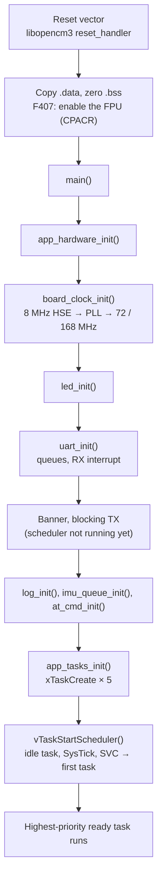
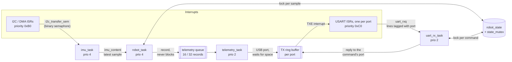

# 03 — Boot and RTOS

From the reset vector to a running control loop: the start-up sequence, the
FreeRTOS tasks and how they communicate, interrupt priorities, tick timing and
the locking scheme.

## Where in the code

| What | Where |
|------|-------|
| Entry point | [`main()`](../src/main.c#L26) |
| Peripheral init before the scheduler | [`app_hardware_init()`](../src/app/app_init.c#L51) |
| Task creation | [`app_tasks_init()`](../src/app/app_init.c#L79) |
| Stack sizes, priorities | [config.h](../src/config.h#L110) |
| Kernel configuration | [FreeRTOSConfig.h](../src/FreeRTOSConfig.h#L92) |
| libopencm3 ↔ FreeRTOS handler glue | [src/rtos_glue/opencm3.c](../src/rtos_glue/opencm3.c) |
| Fault and RTOS hooks | [fault_handlers.c](../src/fault/fault_handlers.c) |

## Boot sequence

Points worth noting:

- **Everything before the scheduler runs without an RTOS.** The banner uses
  `usart_send_blocking()` because `uart_write()` relies on the kernel. Queues can
  already be created (they only need the heap), and interrupts that post to
  them are safe once the objects exist, which is why `uart_init()` creates the
  queues *before* enabling the RX interrupt.
- **The IMU is initialised inside its task**, not in `app_hardware_init()`: the
  MPU-6050 driver uses a semaphore and `vTaskDelay`, which need a running
  kernel.
- **Handler glue.** libopencm3 owns the vector table and calls
  `sv_call_handler`, `pend_sv_handler` and `sys_tick_handler`;
  [opencm3.c](../src/rtos_glue/opencm3.c) forwards them to the FreeRTOS port.

## Tasks

| Task | Priority | Stack (words) | Runs | Blocks on |
|------|----------|---------------|------|-----------|
| `imu_task` | 4 (`TASK_PRIORITY_CONTROL`) | 192 | Every `IMU_SAMPLE_RATE_MS` (10 ms) | `vTaskDelayUntil`, DMA semaphore |
| `robot_task` | 4 (`TASK_PRIORITY_CONTROL`) | 256 | Once per IMU sample | `imu_content` queue |
| `uart_rx_task` | 2 (`TASK_PRIORITY_IO`) | 384 | Once per received line, any console port | `uart_rxq` queue |
| `telemetry_task` | 2 (`TASK_PRIORITY_IO`) | 256 | Once per record while `AT+STREAM=1` | Telemetry queue, USB TX buffer space |
| `led_task` | 1 (`TASK_PRIORITY_LED`) | 64 | Every 250 ms | `vTaskDelayUntil` |
| Idle | 0 | 128 | When nothing else is ready | — |

Stack sizes are in **words**: 256 words is 1024 bytes on a 32-bit MCU.

**Why these priorities.** Only the sensing/control chain has a deadline. With
fixed-priority preemptive scheduling, a higher priority guarantees that a
burst of AT traffic or streaming output can never delay a control period. The
two control tasks share a priority because they never compete: the robot task
only becomes ready when the IMU task has just finished. The LED is lowest, so a
blinking LED is also a coarse "the CPU is not saturated" indicator.

## Communication between tasks and interrupts

| Object | Type | Created in | Producer → consumer |
|--------|------|------------|---------------------|
| `imu_content` | Queue, 1 × `IMU_Data_t`, written with `xQueueOverwrite` | [imu.c](../src/imu/imu.c#L33) | `imu_task` → `robot_task` |
| `i2c_transfer_sem` | Binary semaphore | [mpu6050.c](../src/imu/mpu6050.c#L104) | DMA callback (ISR) → `imu_task` |
| `uart_rxq` | Queue, 8 × `UART_Line_t` (port + line) | [uart.c](../src/drivers/uart.c) `uart_init()` | USART ISRs → `uart_rx_task` |
| TX ring buffers | 4096 / 1024 bytes (USB, F407 / F103), 512 (Bluetooth) | [uart.c](../src/drivers/uart.c) | `uart_write()` → USART ISR |
| Telemetry queue | Queue, 32 / 16 × record | [telemetry.c](../src/telemetry/telemetry.c) | `robot_task` → `telemetry_task` |
| `state_mutex` | Mutex (priority inheritance) | [robot.c](../src/robot/robot.c#L390) | `robot_task` ↔ AT handlers |

### Latest-sample mailbox

`imu_content` holds exactly one sample, and the IMU task overwrites it. A
control loop must act on the newest measurement: with a deeper queue, any delay
in `robot_task` would make it work through a backlog of old samples, adding
latency exactly when the loop is already late.

Two failure rules go with it:

- A failed sensor read is **not published**, so stale cached values never look
  like a new sample.
- If no sample arrives for `IMU_STALL_TIMEOUT_MS` (5 periods, 50 ms),
  `robot_task` **stops the motors** and requires `AT+ENABLE` again.

### The state lock

`robot_state` holds the sensor values, gains and flags shared between the
control loop and the AT console. Both sides take `state_mutex`:

- **`robot_task`** locks once per sample around the state update, PID and motor
  commands, and never while blocked on its queue.
- **The AT parser** locks only around a set/execute callback, or to take a
  snapshot for a query ([`at_cmd_set_lock()`](../src/cmd/at_cmd.c#L108)).
  Responses are printed **after** unlocking. Printing can wait for UART buffer
  space, and holding the lock while waiting would stall the control loop.
- **Priority inheritance.** When `robot_task` (prio 4) waits for the mutex held
  by `uart_rx_task` (prio 2), the kernel temporarily raises the holder to
  prio 4. Otherwise a medium-priority task could preempt the holder and delay
  the control loop indefinitely: the classic priority inversion. This is why
  it is a mutex (`configUSE_MUTEXES 1`) and not a binary semaphore.
- **Layering.** The parser receives lock/unlock function pointers from the
  robot module instead of including `robot.h`, so `cmd/` stays independent of
  `robot/`.

## Interrupt priorities

Cortex-M priorities are numbers where **lower is more urgent**. STM32 implements
4 bits, stored in the upper nibble, so the usable values are 0x00, 0x10 … 0xF0.

FreeRTOS divides that range in two with `configMAX_SYSCALL_INTERRUPT_PRIORITY`
(191, effectively 0xB0):

- ISRs at 0xB0 **or less urgent** may call `…FromISR()` APIs. The kernel masks
  them (BASEPRI) inside critical sections.
- ISRs **more urgent** than 0xB0 are never masked by the kernel, so they get
  the lowest latency, but they must not call any FreeRTOS function.

| Interrupt | NVIC priority | Calls FreeRTOS? | Set in |
|-----------|---------------|-----------------|--------|
| F103 encoder EXTI9_5 | 0x80 | No (counter increment only) | [motor.c](../src/motor/motor.c#L140) |
| I2C event/error, DMA TX/RX | 0xB0 | Yes (`xSemaphoreGiveFromISR`) | [`i2c_init_dma(&i2c, 11)`](../src/imu/mpu6050.c#L121) |
| Console USART | 0xC0 | Yes (`xQueueSendFromISR`) | [uart.c](../src/drivers/uart.c#L134) |
| SysTick, PendSV (kernel) | 0xF0 | — | `configKERNEL_INTERRUPT_PRIORITY` |

The I2C/DMA interrupts used to be at 0x50, above the limit, while calling
`xSemaphoreGiveFromISR`. That kind of bug corrupts kernel lists only
occasionally and is very hard to trace. `configASSERT` is now defined
([FreeRTOSConfig.h](../src/FreeRTOSConfig.h#L139)), which enables the port's
check: an ISR with an invalid priority calling a FromISR API halts the system
immediately, at the offending call.

## Ticks and timing

**SysTick** is clocked from AHB/8 (`configSYSTICK_CLOCK_HZ`) and fires every
tick at `FREERTOS_TICK_RATE_HZ` = 1000:

| Board | SysTick input | Reload for 1 kHz | Fits 24 bits? |
|-------|---------------|------------------|---------------|
| F103 | 72 MHz / 8 = 9 MHz | 9 000 | Yes |
| F407 | 168 MHz / 8 = 21 MHz | 21 000 | Yes |

**`pdMS_TO_TICKS` truncates.** At the former 250 Hz tick, `pdMS_TO_TICKS(10)`
was 2 ticks = 8 ms while the filters assumed 10 ms. At 1 kHz every whole
millisecond is exact, and CMake rejects any `IMU_SAMPLE_RATE_MS` that is not a
whole number of ticks.

**`vTaskDelayUntil` vs `vTaskDelay`.**

| Call | Wakes at | Period |
|------|----------|--------|
| `vTaskDelay(n)` | now + n | n + execution time: drifts |
| `vTaskDelayUntil(&last, n)` | last + n, then `last += n` | Exactly n on average |

`vTaskDelayUntil` only works if `last` persists across iterations. The IMU task
used to reinitialise it inside the loop, silently turning it into
`vTaskDelay`; it is now read once before the loop
([imu.c](../src/imu/imu.c#L128)).

### One control period

| t (ms) | Event |
|--------|-------|
| 0.0 | Tick: `imu_task` becomes ready and preempts any priority 1–2 task |
| ~0.1 | START + address + register on I2C (polled), DMA takes over the 14-byte read |
| ~2 | DMA transfer complete ISR → semaphore → `imu_task` resumes, scales, queues |
| ~2.1 | `robot_task` wakes: filters, lock, PID, motor PWM, unlock |
| ~2.3 | Both control tasks blocked: UART and LED tasks run |
| 10.0 | Next tick-aligned wake-up |

About 2 ms of each 10 ms period is spent reading the sensor. The rest is idle
time available for console I/O. The effect of this latency on stability is in
[06 §4](06-control-theory.md#4-going-digital-sampling-and-delay).

## Memory and fault detection

| Mechanism | Setting | What it catches |
|-----------|---------|-----------------|
| Heap | `heap_4`, `FREERTOS_TOTAL_HEAP_SIZE` 10 K (F103) / 32 K (F407) | All kernel objects are allocated once at start-up |
| Stack overflow check | `configCHECK_FOR_STACK_OVERFLOW 1` | Stack pointer outside the task stack at a context switch → [hook](../src/fault/fault_handlers.c) |
| Malloc failed hook | `configUSE_MALLOC_FAILED_HOOK 1` | Heap exhausted while creating objects |
| `configASSERT` | `vAssertCalled()`: motors off, report file:line, halt | Kernel misuse, including invalid ISR priorities |
| Hard fault | `hard_fault_handler()` | Bus/usage faults |
| Independent watchdog | `WATCHDOG`, 500 ms, refreshed by `robot_task` | A hung or deadlocked control task; frozen while a debugger halts the core |

**Every fault path first calls `motor_emergency_stop()`.** The PWM timers keep
running after the CPU halts, so without it a crashed robot would keep driving at
its last duty cycle. The function only writes registers, so it is safe with
interrupts disabled.

Fault handlers then print over the console UART when `FAULT_VERBOSE`
is on, and blink the board LED at a rate that identifies the fault
(all in [fault_handlers.c](../src/fault/fault_handlers.c)).

## Limitations and next steps

- The watchdog only supervises `robot_task`. A stalled IMU task is caught by
  the sample timeout instead, and the console tasks are not supervised.
- Stack sizes are estimates; enable `INCLUDE_uxTaskGetStackHighWaterMark` to
  measure real usage.
- Commands from the USB and Bluetooth consoles are not arbitrated: the last
  command wins, and a dropped Bluetooth link does not stop the robot.
