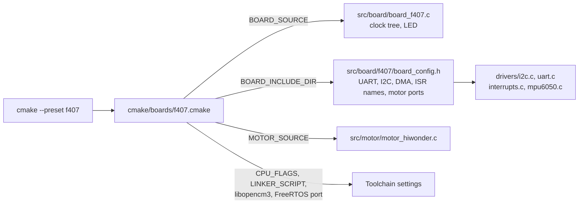
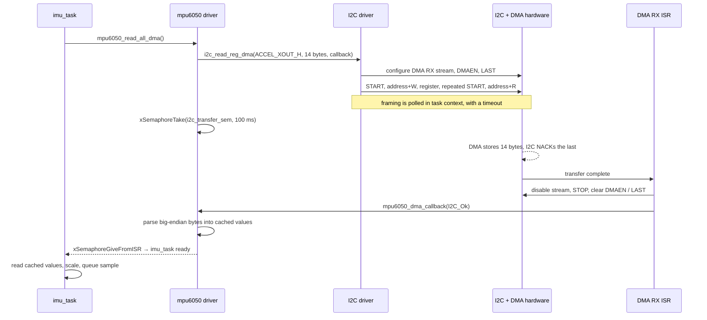
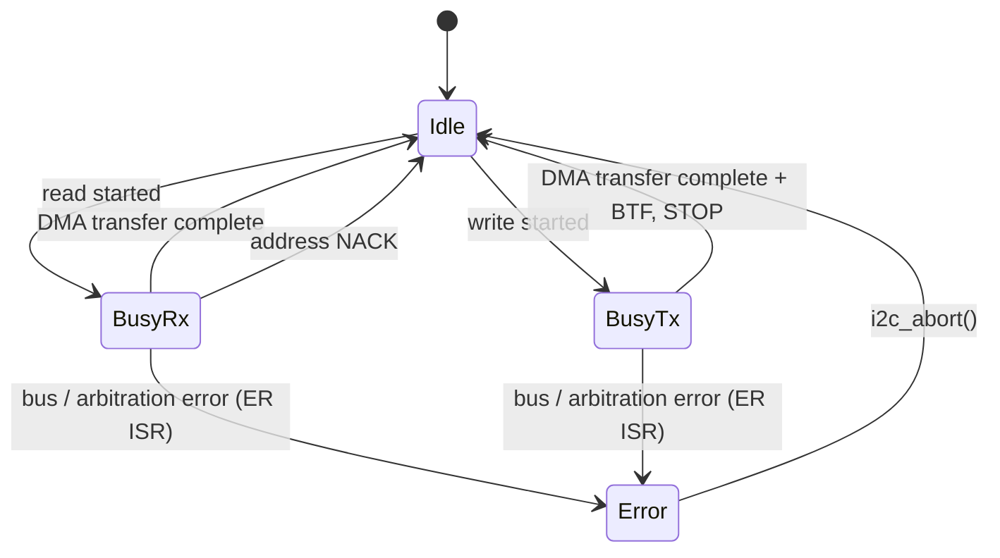
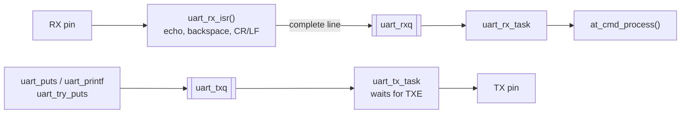

# 04 — Drivers and the Board Layer

How one set of drivers runs on two STM32 families and two very different
boards, what actually differs between STM32F1 and STM32F4, and how the I2C,
UART, PWM and encoder paths work in detail.

## Where in the code

| What | Where |
|------|-------|
| Board peripheral assignments | [f103/board_config.h](../src/board/f103/board_config.h), [f407/board_config.h](../src/board/f407/board_config.h) |
| Clock and LED per board | [board_f103.c](../src/board/board_f103.c), [board_f407.c](../src/board/board_f407.c) |
| Per-board build selection | [cmake/boards/](../cmake/boards) |
| GPIO API compatibility | [gpio_compat.h](../src/drivers/gpio_compat.h) |
| Interrupt handler wiring | [interrupts.c](../src/interrupts.c) |
| I2C (polling, IT, DMA) | [i2c.c](../src/drivers/i2c.c): [`i2c_read_reg_dma()`](../src/drivers/i2c.c#L909), [`i2c_dma_rx_isr()`](../src/drivers/i2c.c#L1187) |
| UART | [uart.c](../src/drivers/uart.c): [`uart_rx_isr()`](../src/drivers/uart.c#L253), [`uart_tx_task()`](../src/drivers/uart.c#L309) |
| PWM | [`pwm_timer_init()`](../src/drivers/pwm.c#L141) |
| Motor drivers | [motor.c](../src/motor/motor.c) (TB6612), [motor_hiwonder.c](../src/motor/motor_hiwonder.c#L68) |

## The board layer

A board is described in three places, all selected by the `BOARD` CMake option:



- **`board_config.h` is found through the include path**, so drivers simply
  `#include "board_config.h"` and use names like `BOARD_UART`, `BOARD_I2C_DMA_RX`
  or `BOARD_I2C_EV_ISR`. There are no `#ifdef BOARD_…` chains in the drivers.
- **Interrupt handlers are named by the board.** libopencm3 provides weak
  handlers with fixed names (`usart2_isr`, `dma1_stream7_isr` …).
  [interrupts.c](../src/interrupts.c) defines `void BOARD_UART_ISR(void)`,
  which the preprocessor turns into the right name for the board.
- **Whole files are swapped when the hardware differs structurally.** The two
  motor drivers share `motor.h` but have nothing else in common.

## STM32F1 vs STM32F4: what actually differs

libopencm3 hides register addresses but not every peripheral design change.
These are the differences this firmware handles:

| Area | STM32F1 | STM32F4 | Handled in |
|------|---------|---------|------------|
| Pin mode API | `gpio_set_mode(port, mode, cnf, pins)` | `gpio_mode_setup()` + `gpio_set_output_options()` | [gpio_compat.h](../src/drivers/gpio_compat.h) |
| Peripheral pin selection | Fixed pins, optional AFIO remap; enable `RCC_AFIO` | Per-pin alternate-function number (`GPIO_AF0…15`) | `BOARD_*_AF`, PWM timer table |
| Input pins for UART RX | Floating input | Alternate-function mode | `gpio_compat_af_input()` |
| DMA | Controller + **channel** (fixed per peripheral) | Controller + **stream** + channel select | [i2c.c](../src/drivers/i2c.c) DMA helpers |
| DMA reconfiguration | Disable channel, reconfigure | Disable stream, **wait for EN = 0**, clear all stream flags before enabling | `i2c_dma_disable()` / `i2c_dma_enable()` |
| Timer input clock | 72 MHz on both buses | APB1 timers 84 MHz, APB2 timers 168 MHz | `pwm_timer_clock_hz()` |
| I2C peripheral | Same IP ("v1") on both | Same IP ("v1") on both | `i2c_set_speed()` from the real APB1 frequency |
| Core / ABI | Cortex-M3, soft float | Cortex-M4F, hard float (`-mfloat-abi=hard`) | `CPU_FLAGS` in board CMake files |
| FreeRTOS port | `ARM_CM3` | `ARM_CM4F` (saves FPU context) | board CMake files |

### Timer clock rule

On STM32, a timer's input clock is its APB bus clock, **doubled whenever that
bus is divided down from AHB**:

```c
uint32_t apb_hz = info->apb2 ? rcc_apb2_frequency : rcc_apb1_frequency;
return (apb_hz == rcc_ahb_frequency) ? apb_hz : 2 * apb_hz;
```

Hard-coding "72 MHz" worked on the Blue Pill and would have produced PWM at
the wrong frequency on the F407. Computing it from libopencm3's clock variables
works for any clock tree.

## I2C with DMA

The MPU-6050 is read in a single 14-byte burst every sample. The CPU only
drives the protocol framing; DMA moves the data bytes.



The driver keeps a small state machine per bus:



Design notes:

- **Why DMA.** Byte-by-byte interrupts cost 14+ interrupts per sample. DMA
  costs one, and the CPU is free during the ~2 ms transfer.
- **`LAST` bit.** Tells the I2C peripheral to NACK the final DMA byte
  automatically, which is how an I2C master ends a read.
- **Bus recovery.** On configuration the driver clocks SCL manually until a
  stuck slave releases SDA, then generates a STOP: the standard fix for a
  sensor left mid-transfer by a reset.
- **Every wait is bounded.** Each polled framing step goes through
  `i2c_wait_sr1()`, which also detects a NACK and gives up after the device
  timeout. A failed start releases the bus and disarms the DMA stream
  (`i2c_dma_start_failed()`), so the next transfer starts clean. The task then
  waits for DMA completion with a 100 ms timeout. The one wait inside an ISR
  (BTF before STOP) is bounded by an iteration count, because an ISR cannot
  sleep.

## UART



- **RX is line-buffered in the ISR.** Characters accumulate in a static buffer;
  on CR or LF the whole line is copied into `uart_rxq`. The task therefore wakes
  once per command, not per character. An overrun flag is cleared by reading
  the data register, so one lost character does not block reception.
- **TX goes through a queue** so that any task can print without owning the
  peripheral. `uart_puts` blocks when the queue is full; `uart_try_puts` checks
  for space first and drops the string instead, which is what the control loop
  uses for telemetry.
- **Echo** is done in the ISR by busy-waiting for TXE: at 921600 baud that is
  ~11 µs per character.

## PWM and motors

[`pwm_timer_init()`](../src/drivers/pwm.c#L141) configures edge-aligned PWM
mode 1:

```math
f_\text{PWM} = \frac{f_\text{timer clock}}{(\text{PSC} + 1)(\text{ARR} + 1)}
```

Motors use 1 kHz with ARR = 999 (0.1 % resolution). TIM1 is an advanced timer:
its outputs stay off until the main output enable (MOE) bit is set.

| | Blue Pill: TB6612FNG | Hiwonder F407: on-board H-bridges |
|---|---|---|
| Speed | 1 PWM per motor (TIM3 CH3/CH4) | PWM on the "forward" **or** "reverse" input |
| Direction | 2 GPIO pins per motor | Which of the two inputs is driven |
| Brake / coast | Both direction pins high / low | Both inputs at 100 % / 0 % |
| Enable | STBY pin | None (standby = both inputs 0) |
| Encoders | Rising edges on EXTI5/6: count only | Quadrature in timer encoder mode (TIM2–5), ×4 counting with direction |

Both drivers implement the same `motor.h` API (`motorN_set_direction`,
`motorN_set_speed`, `motor_standby` …), so `robot.c` is unaware of the
difference. The Hiwonder driver always clears the opposite input before
driving one, so a direction change can never drive both inputs at once.

## Porting to a new board

1. **Pick the family.** Build libopencm3 for it and check a FreeRTOS port
   exists (`ARM_CM3`, `ARM_CM4F`, `ARM_CM7` …).
2. **Add `cmake/boards/<board>.cmake`**: MCU family, libopencm3 library, CPU
   flags, linker script, FreeRTOS sources, clock frequency, default heap, board
   and motor sources. Add the board to `BOARDS` in `CMakeLists.txt` and a
   preset in `CMakePresets.json`.
3. **Add a linker script** with the correct flash and RAM sizes.
4. **Write `src/board/board_<board>.c`**: `board_clock_init()`,
   `board_led_init()`, `board_led_toggle()`.
5. **Write `src/board/<board>/board_config.h`** from the schematic: console
   UART, I2C bus and pins, alternate functions, DMA mapping (from the
   reference manual's DMA request table), interrupt names from libopencm3's
   `nvic.h`.
6. **Motors.** Reuse a motor driver if the driver IC matches, otherwise write
   one implementing `motor.h`.
7. **Verify.** Build with no warnings, check `nm` shows your ISRs as strong
   symbols, then bring the board up in the order: LED blink → console →
   IMU → motors ([09](09-tuning-and-experiments.md)).

## Limitations and next steps

- The polled multi-byte path of `i2c_read()` (not used by the MPU-6050 driver)
  increments its index twice per byte; rewrite it before relying on it.
- UART echo busy-waits inside the ISR; fine at high baud rates, not at 9600.
- The Blue Pill encoders have no direction information and are not used by the
  controller.
