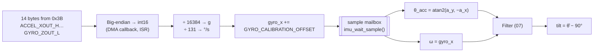

# 05 — Sensing and the IMU

How the MPU-6050 is configured, how raw register bytes become a tilt angle, and
the calibration and sampling choices that affect the controller.

## Where in the code

| What | Where |
|------|-------|
| Sensor interface | [`IMU_Ops_t`](../src/imu/imu.h#L90), implemented by [`mpu6050_ops`](../src/imu/mpu6050.c#L172) |
| Sensor initialisation | [`mpu6050_init()`](../src/imu/mpu6050.c#L109) |
| Burst read, parsing and scaling | [`mpu6050_read()`](../src/imu/mpu6050.c#L143), [`transfer_callback()`](../src/imu/mpu6050.c#L79) |
| Calibration and publishing | [`imu_task()`](../src/imu/imu.c#L60) |
| Scale factors | [mpu6050.h](../src/imu/mpu6050.h#L30) |
| Calibration constant | [`GYRO_CALIBRATION_OFFSET`](../src/config.h#L55) |
| Sampling task | [`imu_task()`](../src/imu/imu.c#L60) |
| Accelerometer tilt and rate | [`imu_tilt()`](../src/imu/imu.c#L48), mounting in `BOARD_TILT_*` ([f103](../src/board/f103/board_config.h), [f407](../src/board/f407/board_config.h)) |

## Configuration

| Setting | Value | Consequence |
|---------|-------|-------------|
| Clock source | PLL on the X gyro | More stable than the internal RC oscillator |
| Gyro full scale | ±250 °/s | 131 LSB per °/s; the robot never rotates faster while balancing |
| Accel full scale | ±2 g | 16384 LSB per g; best resolution for measuring gravity |
| Sleep | Disabled | The sensor powers up asleep |
| Digital low-pass filter | `IMU_DLPF_MODE`: 42 Hz (DLPF_CFG = 3) | Blocks vibration above the 50 Hz Nyquist limit, adds ~4.8 ms delay, see [Sampling](#sampling-and-aliasing) |
| Sample rate divider | Reset default | 1 kHz internal output rate, above the 100 Hz read rate |

The I2C address is 0x68 (AD0 low). At start-up the task retries initialisation
every second until the sensor answers.

## From bytes to tilt

### Register layout

| Bytes | Register | Content |
|-------|----------|---------|
| 0–1 | 0x3B–0x3C | Accel X |
| 2–3 | 0x3D–0x3E | Accel Y |
| 4–5 | 0x3F–0x40 | Accel Z |
| 6–7 | 0x41–0x42 | Temperature (skipped) |
| 8–9 | 0x43–0x44 | Gyro X |
| 10–11 | 0x45–0x46 | Gyro Y |
| 12–13 | 0x47–0x48 | Gyro Z |

One burst reads all axes from the same internal sample, so the accelerometer
and gyroscope values are time-consistent. Six separate reads would mix samples
taken at different instants.

### Axes and mounting

How the sensor sits is a **board property**. Each `board_config.h` names the
two accelerometer axes that span the balance plane and the gyro axis the robot
pitches about, and [`imu_tilt()`](../src/imu/imu.c#L48) turns a sample into
`acc_deg = atan2(NUM, DEN)` and `rate_dps`: 0° upright, positive when leaning
forward. The control task only sees those two numbers.

| Board | `BOARD_TILT_ACC_NUM` | `BOARD_TILT_ACC_DEN` | `BOARD_TILT_RATE` | Mounting |
|-------|------|------|------|----------|
| f103 | `acc_x` | `acc_y` | `gyro_x` | MPU-6050, Y up when upright (the former `atan2(a_y, −a_x) − 90°`) |
| f407 | `acc_y` | `acc_z` | `gyro_x` | QMI8658 on the board, lying flat chip side up (Z up); axle assumed along X |

A differently mounted sensor changes these three macros and nothing else. If
leaning forward reads negative, negate `NUM` and `RATE` together; the gyro rate
must be the time derivative of the accelerometer angle, or the filters fight.

## Gyro calibration

MEMS gyros report a non-zero rate at rest (bias), which integrates into drift.
The firmware adds a constant offset to `gyro_x` only.

The value is **−0.69 °/s**, `GYRO_CALIBRATION_OFFSET` in
[config.h](../src/config.h#L63). To calibrate, read `AT+GYRO_X?` with the
robot still and adjust the config.h value by the negative of the reading
([09](09-tuning-and-experiments.md#2-gyro-calibration)).

A fixed offset does not follow temperature changes; the complementary filter
tolerates the residual error ([07 §2](07-sensor-fusion.md#what-gyro-bias-does)).

## Sampling and aliasing

The firmware samples at 100 Hz, so anything above 50 Hz (the Nyquist limit)
**aliases**. Motor and gear vibration at, say, 80 Hz shows up as a 20 Hz
component that is indistinguishable from real motion, and no digital filter
after sampling can remove it.

At its reset default the MPU-6050's low-pass filter is at its widest
(~250 Hz), which lets that vibration through. The driver therefore sets the
DLPF (register `CONFIG`, 0x1A) to 42 Hz via `IMU_DLPF_MODE`, removing most of
it inside the sensor before sampling. The price is about 4.8 ms of delay, which
comes straight out of the phase margin budget in
[06 §4](06-control-theory.md#4-going-digital-sampling-and-delay). Narrower
settings (20 Hz, ~8.5 ms) filter more but cost more phase.

## Hard reset (Blue Pill only)

On the Blue Pill build the MPU-6050 supply is switched by PA10, so the driver
can power-cycle a sensor that stopped responding. On the F407 board the IMU is
powered directly, so `BOARD_IMU_RESET_PORT` is
not defined and the reset is skipped.

## Limitations and next steps

- Bias correction on one axis, fixed, not temperature compensated.
- If the sensor stops answering, failed reads are not published and the
  controller stops the motors after 50 ms
  ([03](03-boot-and-rtos.md#latest-sample-mailbox)), but the sensor is not
  re-initialised.
- Next steps: measure the gyro bias at start-up while the robot is still, and
  re-initialise the IMU after repeated read failures.
