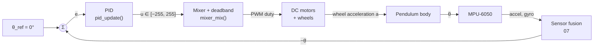
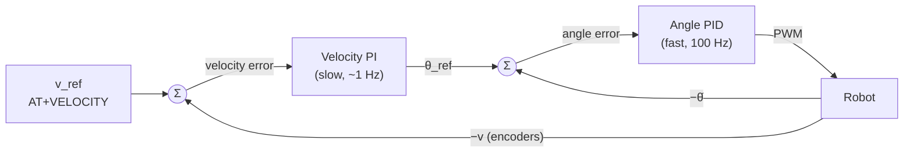

# 06 — Control Theory: Balancing an Inverted Pendulum

This chapter builds the model the firmware is controlling, explains why the
PID in [`pid_update()`](../src/control/pid.c#L27) can stabilise it, what
sampling and delay do to that argument, and where a state-space controller
would take it next. [08 — PID Implementation](08-pid-implementation.md) then
walks through the code line by line.

## Where in the code

| Concept | Where |
|---------|-------|
| Setpoint, safety limits | [`BALANCE_SETPOINT`, `MAX_TILT_ANGLE`](../src/robot/robot.c#L46) |
| Control law | [`pid_update()`](../src/control/pid.c#L27) |
| Actuation (mixing, saturation, deadband) | [`mixer_mix()`](../src/control/mixer.c#L20) |
| Sample period | `IMU_SAMPLE_RATE_MS` → [`vTaskDelayUntil`](../src/imu/imu.c#L83) |
| Unused hooks for an outer loop | `target_velocity` in [robot_internal.h](../src/robot/robot_internal.h), [`motor_get_encoder()`](../src/motor/motor.h) |

## The closed loop



Everything to the left of the motors runs once per sample (10 ms by default);
everything to the right is continuous physics. The rest of this chapter models
the right-hand side and then closes the loop.

## 1. Plant model

### Equations of motion

Idealise the robot as a point mass *m* at height *l* above the wheel axle. The
wheels move the axle horizontally with acceleration *a*. In the axle's
(accelerating) frame the mass feels gravity *g* downward and a pseudo-force
*m·a* backward. Taking moments about the axle, with θ the tilt from vertical
(positive = leaning forward, the firmware's convention):

```math
l\,\ddot\theta = g\,\sin\theta - a\,\cos\theta
```

A real robot adds wheel inertia, the body's own moment of inertia and motor
dynamics. These change the numbers (the *effective* length is somewhat larger
than the height of the centre of mass) but not the structure, which is what
matters for control design.

### Linearisation

The controller keeps θ within a few degrees of zero, so use
sin θ ≈ θ and cos θ ≈ 1 (the error at 10° is 0.5 % and 1.5 %):

```math
\ddot\theta = \frac{g}{l}\,\theta - \frac{1}{l}\,a
```

### Transfer function and the unstable pole

Laplace transform with zero initial conditions:

```math
G(s) = \frac{\Theta(s)}{A(s)} = \frac{-1/l}{s^2 - g/l},
\qquad \text{poles } s = \pm p,\; p = \sqrt{g/l}
```

The pole at +p is in the right half-plane: without control, any small tilt
grows as e^{pt}. For an effective length l = 0.10 m:

| Quantity | Value |
|----------|-------|
| p = √(g/l) | 9.9 rad/s |
| Time constant 1/p | 101 ms |
| Tilt doubling time ln 2 / p | 70 ms |

That doubling time is the budget the whole firmware works against: a 10 ms
sample period gives about seven control updates per doubling. Taller robots
(larger *l*) are slower and easier to balance, just like balancing a broom
rather than a pencil.

## 2. Why PD stabilises it

Assume the controller commands the wheel acceleration directly from the angle
and its rate (units absorbed into the gains):

```math
a = K_p\,\theta + K_d\,\dot\theta
```

Substituting into the linear model gives the closed loop:

```math
l\,\ddot\theta + K_d\,\dot\theta + (K_p - g)\,\theta = 0
```

A second-order polynomial is stable exactly when all coefficients are positive:

- **K_p > g.** The wheels must accelerate under the body faster than gravity
  pulls it over. Below that, the robot falls no matter what K_d is.
- **K_d > 0.** Without damping the best case is a sustained oscillation, and
  any delay in the loop (section 4) turns it into a growing one.

The resulting dynamics:

```math
\omega_n = \sqrt{\frac{K_p - g}{l}}, \qquad
\zeta = \frac{K_d}{2\sqrt{l\,(K_p - g)}}
```

Raising K_p makes the response faster (higher ω_n) but less damped; raising
K_d adds damping. That is the whole of the tuning procedure in
[09](09-tuning-and-experiments.md), derived.

### Root locus intuition

With the PD zero at s = −K_p/K_d, the root locus starts at the open-loop poles
±p and bends towards the zero. For small gains one branch stays in the right
half-plane (the robot falls). Once K_p passes g, both branches are in the left
half-plane and meet on the real axis or form a complex pair depending on ζ.
Placing the zero closer to the origin (more K_d relative to K_p) pulls the locus
further left, which buys the phase margin section 4 needs.

### What the integral term does and does not fix

If the centre of mass is not exactly above the IMU's "upright", or the IMU is
mounted slightly tilted, the robot's true equilibrium is at θ₀ ≠ 0. A PD loop
settles where K_p·θ balances that offset, which means **constant
acceleration**: the robot drives away while leaning. The I term drives the
steady-state angle error to zero, but the physics has not changed: holding the
true equilibrium still needs a velocity loop to stop the drift (section 6).

## 3. The actuator is not an accelerometer

The firmware commands PWM duty, which is close to motor **voltage**, not wheel
acceleration. A DC motor produces torque

```math
\tau = \frac{k_t}{R}\,\bigl(V - k_e\,\omega\bigr)
```

- **At low wheel speed** torque, and so acceleration, is roughly proportional to
  duty, and the model above holds.
- **As the wheels speed up** back-EMF (k_e·ω) eats into the available torque.
  The effective loop gain falls, which is one reason a robot that balances in
  place struggles once it is moving fast.
- **Static friction** creates a dead zone: small duty cycles produce no motion.
  `MOTOR_DEADBAND` in [robot.c](../src/robot/robot.c#L51) lifts any non-zero
  command to a minimum PWM of 20/255 (8 %).
- **Saturation**: duty is limited to ±255. A disturbance that needs more
  acceleration than full voltage provides cannot be recovered, whatever the
  gains.

## 4. Going digital: sampling and delay

### Sampling

The loop runs at T = 10 ms (ω_s = 628 rad/s), far above the plant pole
p ≈ 10 rad/s. At this ratio the continuous-time design carries over directly.
The firmware discretises with a forward sum for the integral and a backward
difference for the derivative:

```math
I_k = I_{k-1} + e_k\,T, \qquad D_k = \frac{e_k - e_{k-1}}{T}
```

**The T in these equations must be the real sample period.** Before the
timing fixes the task actually ran every 8 ms while the code assumed 10 ms,
scaling the I term by 0.8 and the D term by 1.25. The build now refuses sample
periods that are not a whole number of RTOS ticks
([02](02-build-and-configuration.md)).

### Delay eats phase margin

Every stage between measuring θ and the motor responding adds delay:

| Source | Approximate delay |
|--------|-------------------|
| Zero-order hold (output held for one period) | T/2 = 5 ms |
| MPU-6050 low-pass filter at 42 Hz | ~4.8 ms |
| I2C burst read of 14 bytes at 100 kHz | ~2 ms |
| Queue hand-off, filter and PID | < 1 ms |
| PWM update at the next timer period (1 kHz) | ≤ 1 ms |
| **Total τ_d** | **≈ 13 ms** |

A pure delay adds phase lag ω·τ_d without changing gain. With a crossover
frequency around 2–3 p ≈ 25 rad/s:

```math
\varphi_\text{delay} = \omega_c\,\tau_d \approx 25 \times 0.013 = 0.33\ \text{rad} \approx 19^\circ
```

The sensor's low-pass filter is the largest deliberate entry. It earns its
phase: without it, vibration above 50 Hz would alias into the loop band where
nothing downstream can remove it ([05](05-sensing-and-imu.md#sampling-and-aliasing)).

That lag is subtracted from the phase margin the PD zero provides. Two
practical consequences for this firmware:

- **Timing jitter is variable delay.** The control tasks run above console I/O
  (priority 4 vs 2) so a burst of AT traffic cannot stretch a control period
  ([03](03-boot-and-rtos.md)).
- **The derivative amplifies noise by 1/T.** A 0.1° noise step becomes 10 °/s
  in the D term. The gyroscope measures θ̇ directly and without that
  amplification; using it as the D input is a recommended improvement
  ([08](08-pid-implementation.md)).

## 5. State-space model

The PID only looks at θ. The full robot also has a wheel position x and
velocity ẋ, and the pendulum equation says nothing stops them from wandering.
With state **x** = [θ, θ̇, x, ẋ]ᵀ and input a:

```math
\dot{\mathbf{x}} =
\begin{bmatrix}
0 & 1 & 0 & 0\\
g/l & 0 & 0 & 0\\
0 & 0 & 0 & 1\\
0 & 0 & 0 & 0
\end{bmatrix}\mathbf{x}
+
\begin{bmatrix} 0 \\ -1/l \\ 0 \\ 1 \end{bmatrix} a
```

### Controllability

The controllability matrix [B, AB, A²B, A³B] is

```math
\begin{bmatrix}
0 & -1/l & 0 & -g/l^2\\
-1/l & 0 & -g/l^2 & 0\\
0 & 1 & 0 & 0\\
1 & 0 & 0 & 0
\end{bmatrix}
```

Its determinant is g²/l⁴ ≠ 0: the system is fully controllable. A single
acceleration input can stabilise tilt *and* hold position.

### LQR

A linear-quadratic regulator picks the state feedback **u** = −K**x** that
minimises

```math
J = \int_0^\infty \left(\mathbf{x}^\mathsf{T} Q\,\mathbf{x} + R\,a^2\right) dt
```

where Q weights state errors and R weights control effort. The gain is
K = [k_θ, k_θ̇, k_x, k_ẋ]. **The firmware's PD loop is this controller with
k_x = k_ẋ = 0**, which is exactly why it cannot hold position: those two
states are a double integrator that no gain acts on.

A discrete-time design for T = 10 ms (plant values are illustrative):

```python
import numpy as np
from scipy.linalg import solve_discrete_are
from scipy.signal import cont2discrete

g, l, T = 9.81, 0.10, 0.010
A = np.array([[0, 1, 0, 0], [g / l, 0, 0, 0], [0, 0, 0, 1], [0, 0, 0, 0]])
B = np.array([[0], [-1 / l], [0], [1]])
Ad, Bd, *_ = cont2discrete((A, B, np.eye(4), np.zeros((4, 1))), T, method="zoh")

Q = np.diag([100.0, 1.0, 1.0, 1.0])   # angle error matters most
R = np.array([[0.1]])
P = solve_discrete_are(Ad, Bd, Q, R)
K = np.linalg.solve(R + Bd.T @ P @ Bd, Bd.T @ P @ Ad)
print("K =", K)                        # u[k] = -K x[k]
```

The measurements for all four states exist on this hardware: θ from
[sensor fusion](07-sensor-fusion.md), θ̇ from the gyroscope, and x, ẋ from
the wheel encoders. The F407 board counts quadrature encoders in hardware
timers; the Blue Pill counts rising edges only, with no direction.

## 6. Cascade control: the next step

LQR needs a good plant model. The usual pragmatic alternative keeps the
existing angle loop and wraps a slower velocity loop around it:



- **The outer loop decides how far to lean.** To stop, it leans the robot
  backwards briefly; to hold a CG offset, it finds the lean angle at which the
  robot stays still. This replaces the angle-loop I term.
- **Bandwidths must be separated** by 5–10×, so the inner loop looks
  instantaneous from the outer one.
- **Firmware hooks already exist**: `target_velocity` is set by
  `AT+VELOCITY`, and the motor API exposes encoder counts. What is missing is a
  velocity estimate (counts per sample, low-pass filtered) and the outer PI.

## Limitations and next steps

- The model ignores wheel inertia, motor dynamics and ground contact; use it
  for structure and orders of magnitude, then tune on the robot.
- The shipped controller is angle-only PID: expect slow drift and a lean when
  the CG is offset.
- Next steps, roughly in order of payoff: use gyro rate as the D input, add the
  velocity loop, then consider LQR with encoder feedback.
