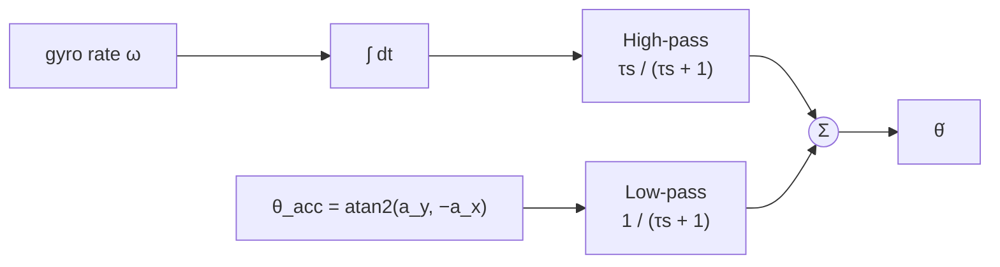

# 07 — Sensor Fusion: Estimating Tilt

The controller needs the tilt angle θ every 10 ms, accurately and with little
delay. No single MEMS sensor provides that. This chapter explains why, derives
the two filters in the firmware, and shows how to measure them on your robot.

## Where in the code

| What | Where |
|------|-------|
| Accelerometer tilt | [`calc_angle_from_accel()`](../src/robot/robot.c#L115) |
| Complementary filter | [`complementary_update()`](../src/filter/complementary.c#L32), `COMPLEMENTARY_ALPHA` in [config.h](../src/config.h#L75) |
| Kalman filter | [`kalman_update()`](../src/filter/kalman.c#L34), `KALMAN_Q_ANGLE` / `KALMAN_R_MEASURE` in [config.h](../src/config.h#L67) |
| Filter selection, seeding | [`robot_task()`](../src/robot/robot.c#L367), `ATTITUDE_FILTER` CMake option |
| Telemetry for analysis | `AT+STREAM`, [`robot_stream_sample()`](../src/robot/robot.c#L159), [test/statistics.py](../test/statistics.py) |

## 1. Two sensors, two error models

### Accelerometer: right on average, noisy right now

At rest the accelerometer measures gravity, so the tilt follows from two axes.
The IMU is mounted with its X axis vertical (X reads about −1 g upright):

```math
\theta_\text{acc} = \operatorname{atan2}(a_y,\; -a_x)
```

Upright gives about 90°; the robot task subtracts 90° to get the control
convention (0 = upright). The accelerometer has **no drift**, but it cannot
tell gravity from the robot's own acceleration. Every time the wheels push,
vibrate or the robot bumps, the measured angle jumps. The error is
**high-frequency**.

### Gyroscope: smooth now, wrong eventually

The gyroscope measures angular rate with a bias *b* and noise *n*:

```math
\omega_\text{meas} = \dot\theta + b + n
```

Integrating gives a clean, fast angle estimate, but the bias integrates too:
a 0.5 °/s bias is 30° of error after a minute. The error is
**low-frequency** (drift). The firmware subtracts a fixed calibration offset
from the X axis ([05](05-sensing-and-imu.md)), which removes most but not all
of *b*, and none of its temperature dependence.

The two error spectra barely overlap, which is what makes fusion work: take the
low frequencies from the accelerometer and the high frequencies from the
gyroscope.

## 2. Complementary filter

### The code

```c
angle = alpha * (angle + gyro_rate * dt) + (1 - alpha) * acc_angle;
```

Each step propagates the previous estimate with the gyroscope, then nudges it a
fraction (1 − α) of the way towards the accelerometer.



### In the frequency domain

In continuous time the filter is

```math
\hat\Theta(s) = \frac{\tau s}{\tau s + 1}\cdot\frac{\Omega(s)}{s}
             + \frac{1}{\tau s + 1}\cdot\Theta_\text{acc}(s)
```

The two transfer functions add up to exactly 1, hence "complementary": a true
angle passes through unchanged, and each sensor only contributes in its good
band. The discrete coefficient maps to the time constant as

```math
\alpha = \frac{\tau}{\tau + T}
\quad\Longleftrightarrow\quad
\tau = \frac{\alpha\,T}{1 - \alpha}
```

| Parameter | Value in this firmware |
|-----------|------------------------|
| α | 0.96 |
| T | 10 ms |
| τ | 0.24 s |
| Crossover f_c = 1/(2πτ) | 0.66 Hz |

Below 0.66 Hz the estimate follows the accelerometer; above it, the gyroscope.

### What gyro bias does

A constant bias *b* no longer drifts without bound; it produces a steady-state
angle error

```math
\theta_\text{err} = b\,\tau
```

A 0.5 °/s residual bias costs 0.12°. Larger α (longer τ) rejects more
accelerometer noise but increases this error and slows recovery from bias
changes.

**Changing the sample rate changes τ.** α is a per-step constant, so halving
`IMU_SAMPLE_RATE_MS` halves τ unless α is recomputed.

## 3. The Kalman filter as implemented

### Model

[`kalman.c`](../src/filter/kalman.c#L34) is a one-state Kalman filter. The state is the
angle; the gyroscope drives the prediction and the accelerometer is the
measurement:

```math
\theta_k = \theta_{k-1} + \omega_k T + w_k, \quad w_k \sim \mathcal{N}(0, Q)
\qquad
z_k = \theta_{\text{acc},k} + v_k, \quad v_k \sim \mathcal{N}(0, R)
```

### Equations, mapped to the code

| Step | Math | Code |
|------|------|------|
| Predict state | θ⁻ = θ + ωT | `kf->angle += gyro_rate * dt;` |
| Predict variance | P⁻ = P + Q | `kf->uncertainty += kf->Q_angle;` |
| Gain | K = P⁻ / (P⁻ + R) | `K = uncertainty / (uncertainty + R_measure)` |
| Update state | θ = θ⁻ + K(z − θ⁻) | `kf->angle += K * (acc_angle - kf->angle);` |
| Update variance | P = (1 − K) P⁻ | `kf->uncertainty *= (1.0f - K);` |

### It converges to a complementary filter

Q and R are constant, so P and K settle to fixed values. Setting P⁻ = M at
steady state:

```math
M^2 - Q\,M - Q\,R = 0
\;\Rightarrow\;
M = \frac{Q + \sqrt{Q^2 + 4QR}}{2},
\qquad K_\infty = \frac{M}{M + R}
```

With the firmware values Q = 0.1 and R = 0.5: M = 0.279, **K∞ = 0.358**.

Compare the update step with the complementary filter: after convergence the
Kalman filter *is* a complementary filter with α = 1 − K∞ = 0.642, i.e.
τ = 18 ms and f_c ≈ 8.9 Hz. It passes accelerometer noise up to a crossover
about 13× higher than the complementary filter's.

That explains the bench measurements below, where the Kalman output is noisier
than the complementary one. **This is a tuning result, not a property of
Kalman filtering.** Q and R are not dimensionless trust knobs:

- R is the accelerometer angle variance in deg²: measure it from
  `acc_deg` at rest (σ ≈ 0.18° gives R ≈ 0.033).
- Q is the variance added per step by gyro noise: (σ_ω · T)² in deg², which
  for MEMS gyros is orders of magnitude below 0.1. Note that the code does not
  scale Q with dt.

With physically derived values the gain drops and the Kalman filter smooths at
least as well as the complementary filter, while also adapting its gain during
start-up.

## 4. The next step: estimating the gyro bias

The classic IMU tilt filter adds the gyro bias to the state, so it is estimated
and removed continuously instead of relying on a fixed calibration constant:

```math
\mathbf{x} = \begin{bmatrix}\theta \\ b\end{bmatrix},\quad
\mathbf{x}_k = \begin{bmatrix}1 & -T\\ 0 & 1\end{bmatrix}\mathbf{x}_{k-1}
             + \begin{bmatrix}T\\0\end{bmatrix}\omega_k,\quad
z_k = \begin{bmatrix}1 & 0\end{bmatrix}\mathbf{x}_k + v_k
```

It needs a 2×2 covariance (still only a few float operations per step) and
gives a drift-free estimate across temperature changes. It is not implemented
yet.

## 5. Lab: compare the filters on your robot

1. Build with the filter you want the **controller** to use. Both filters
   always run, so the stream shows both regardless:
   ```bash
   cmake --preset f103 -DATTITUDE_FILTER=complementary
   cmake --build --preset f103 --target flash
   ```
2. Connect the console and start streaming:
   ```
   AT+STREAM=1
   ```
3. Close the terminal (the script needs the port), then run the analysis. Edit
   `SERIAL_PORT` / `BAUD_RATE` at the top of the script if needed:
   ```bash
   cd test && python3 statistics.py
   ```
   It collects 1000 lines (10 s at 100 Hz), prints noise statistics and writes
   `img/filter_comparison.png`.
4. Repeat with the robot held still, then gently rocked. The still data
   measures noise; the rocking data shows lag. A good filter is quiet at rest
   *and* tracks rocking without visible delay.

### Bench results in this repository

Recorded with the robot at rest:


| Signal | Std deviation |
|--------|---------------|
| Accelerometer angle | 0.181° |
| Kalman (Q = 0.1, R = 0.5) | 0.090° |
| Complementary (α = 0.96) | 0.025° |

An earlier run comparing only the accelerometer and Kalman output:


## Limitations and next steps

- Linear acceleration during aggressive driving still corrupts the
  accelerometer term; the gyroscope dominates only above f_c.
- Gyro bias is corrected by a fixed constant on one axis.
- Next steps: retune Q and R from measured variances, then implement the
  bias-estimating filter from section 4.
