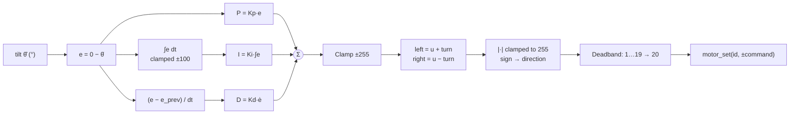
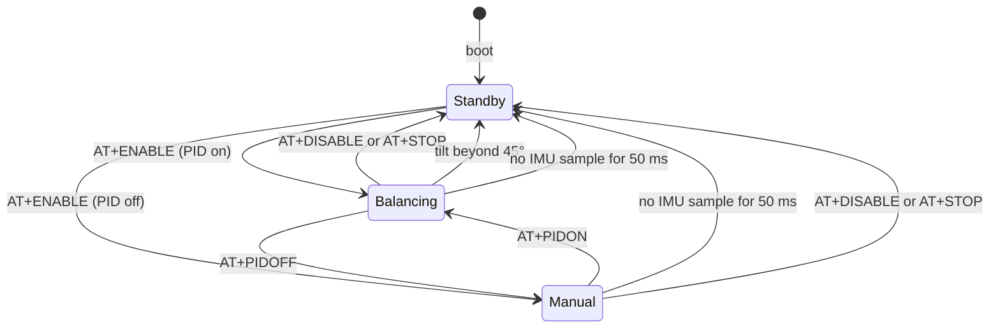

# 08 — PID Implementation

The balance controller exactly as coded: every term, limit and safety check in
[`pid_update()`](../src/control/pid.c#L27),
[`mixer_mix()`](../src/control/mixer.c#L20) and
[`robot_balance_step()`](../src/robot/robot.c#L141), why each is there, and
what to improve. The theory is in [06](06-control-theory.md).

## Where in the code

| What | Where |
|------|-------|
| Default gains | [`ROBOT_DEFAULT_KP/KI/KD`](../src/robot/robot.c#L40) |
| Setpoint, fall limit, deadband, PWM limit | [robot.c constants](../src/robot/robot.c#L45) |
| Integral limit | [`integral_limit`](../src/robot/robot.c#L67) |
| Control law | [`pid_update()`](../src/control/pid.c#L27), state in [`PID_t`](../src/control/pid.h) |
| Mixing and actuation | [`mixer_mix()`](../src/control/mixer.c#L20), [`robot_balance_step()`](../src/robot/robot.c#L141) |
| Loop, safety, enabling | [`robot_task()`](../src/robot/robot.c#L158), [robot_commands.c](../src/robot/robot_commands.c) |

## Signal chain



## The control law

```c
float error = BALANCE_SETPOINT - angle;

/* pid_update(&robot.pid, error, IMU_SAMPLE_RATE_S) */
pid->p_term = pid->kp * error;

pid->integral = clamp(pid->integral + error * dt, pid->integral_limit);
pid->i_term = pid->ki * pid->integral;

pid->d_term = pid->kd * (error - pid->prev_error) / dt;
pid->prev_error = error;

pid->output = clamp(pid->p_term + pid->i_term + pid->d_term, pid->output_limit);
```

In discrete-time form, with sample index k and T = `IMU_SAMPLE_RATE_S`:

```math
u_k = K_p e_k \;+\; K_i \operatorname{clamp}\!\Bigl(\sum_{j\le k} e_j T,\; \pm 100\Bigr) \;+\; K_d \frac{e_k - e_{k-1}}{T}
```

### Units

The error is in degrees and the output in PWM counts (±255 = ±100 % duty):

| Gain | Default | Meaning |
|------|---------|---------|
| Kp | 25 | 1° of tilt → 25 counts (≈ 10 % duty) |
| Ki | 0.5 | 1 °·s of accumulated error → 0.5 counts |
| Kd | 0.8 | 1 °/s of tilt rate → 0.8 counts |

### Sample time

dt is `IMU_SAMPLE_RATE_S`, a compile-time constant. That is only correct if the
loop really runs at that period, which the fixed-rate IMU task and the CMake
tick check now guarantee ([03](03-boot-and-rtos.md#ticks-and-timing)). A wrong
dt silently rescales Ki by T_real/T and Kd by T/T_real.

## Integral and anti-windup

Integral windup happens when the output is saturated (or the robot is held)
while the error persists: the integral keeps growing, and once the robot is
released it overshoots badly while the integral unwinds.

The firmware clamps the **accumulated error** to ±100 °·s. The largest possible
I contribution is therefore Ki × 100 = 50 counts (20 % duty) with the default
gains.

Trade-offs of this scheme:

- **Simple and cheap**, and changing Ki at runtime takes effect immediately
  instead of scaling a stored I value.
- **The clamp does not depend on saturation**: the integral keeps accumulating
  up to the limit while the output is pinned at ±255. Conditional integration
  (freeze the integral while saturated in the same direction) or
  back-calculation reduce overshoot further.
- **`pid_reset()` clears the integral** on `AT+ENABLE`, `AT+PIDOFF` and after a
  fall, so a new balancing attempt never starts with stale windup.

## Derivative

The D term differentiates the **error**. With a constant setpoint this equals
−Kd × dθ̂/dt, so there is no "derivative kick". That changes as soon as an outer
loop moves the setpoint (cascade control, [06 §6](06-control-theory.md#6-cascade-control-the-next-step)):
a setpoint step would then produce a one-sample spike. Differentiating the
measurement avoids it.

**Noise gain.** The difference quotient amplifies measurement noise by 1/T =
100. A 0.05° noise step is a 5 °/s derivative, i.e. 4 counts of motor jitter at
Kd = 0.8, every sample. The symptom is motor buzz as Kd rises.

**The better input already exists.** The gyroscope measures the tilt rate
directly, and it is already calibrated in `imu_data.gyro_x`:

```c
pid->d_term = -pid->kd * imu_data.gyro_x;   /* suggested improvement */
```

This removes the differentiation noise and one sample of delay. Alternatively,
low-pass the difference quotient with a time constant of a few samples.

## Output stage

### Saturation and mixing

```c
/* mixer_mix(output, robot.turn_rate, MOTOR_COMMAND_MAX, MOTOR_DEADBAND) */
.left  = mixer_wheel(output + turn, limit, deadband),
.right = mixer_wheel(output - turn, limit, deadband),

/* in mixer_wheel(): saturate before narrowing */
int16_t magnitude = (int16_t)fminf(fabsf(value), (float)limit);
```

The PID output is clamped to ±255 before mixing. Adding a turn rate (±100) can
push a wheel command past 255 again, so each wheel is saturated **before**
narrowing to an integer. Without that second clamp, a command of 300 wrapped to
44: near full power became low power exactly when the robot needed the most
torque.

### Direction

The sign of each wheel command selects the direction and the magnitude becomes
the PWM duty. Positive output means drive forward, towards a positive
(forward) tilt, putting the wheels back under the centre of mass.

### Deadband compensation

```c
if (magnitude > 0 && magnitude < deadband) {
    magnitude = deadband;
}
```

Static friction means small duty cycles do not move the wheels. Lifting any
non-zero command to 20 counts makes the controller effective near upright.

The mapping is **discontinuous**: commands 1–19 all become 20. Around the
balance point the output keeps jumping between 0 and 20 counts, which can cause
a small limit cycle. An offset mapping keeps it continuous and monotonic:

```math
u' = \operatorname{sign}(u)\left(d + |u|\,\frac{255 - d}{255}\right), \qquad u \ne 0
```

## Enabling, disabling and safety



| State | `motors_enabled` | `pid_enabled` | Motors |
|-------|------------------|---------------|--------|
| Standby | false | any | Driver in standby |
| Balancing | true | true | Commanded by the PID every sample |
| Manual | true | false | Commanded only by `AT+SPEED` |

- **Start-up is safe by default**: the motor driver is put in standby before the
  AT handlers are registered.
- **Fall detection.** Beyond `MAX_TILT_ANGLE` (45°) recovery is physically
  impossible with the available torque. The loop disables the motors, enters
  standby and resets the PID instead of spinning the wheels at full speed on
  the floor.
- **Sensor stall.** If no IMU sample arrives for `IMU_STALL_TIMEOUT_MS` (50 ms)
  while the motors are enabled, the loop disables them the same way: acting on a
  stale angle is worse than stopping.
- **Faults.** Hard faults, stack overflows, failed asserts and watchdog resets
  all leave the motors undriven ([03](03-boot-and-rtos.md#memory-and-fault-detection)).
- **Balanced flag.** `is_balanced` (|tilt| < 5°) is informational, reported by
  `AT+STATUS?`; it does not affect control.
- **Concurrency.** Gains are read and the motors written while `state_mutex` is
  held, so an `AT+KP` arriving mid-sample is applied at a sample boundary and
  never races with a motor command from `AT+SPEED`.

## A worked sample

Robot at rest upright, then pushed to 2° in one sample, with the default gains:

| Term | Calculation | Counts |
|------|-------------|--------|
| P | 25 × (−2) | −50 |
| I | 0.5 × (−2 × 0.01) | −0.01 |
| D | 0.8 × (−2 − 0) / 0.01 | −160 |
| Output | clamp(−210.01, ±255) | −210 |

A sudden change is dominated by D on the first sample, then P takes over. This
is also why a single noisy angle sample can produce a large motor pulse, the
case for using the gyro rate as D input.

## Limitations and next steps

In order of expected payoff:

1. D from the gyro rate instead of differencing the angle.
2. Continuous deadband compensation.
3. Conditional integration while saturated.
4. A velocity loop around the angle loop (turns `AT+VELOCITY` on).
