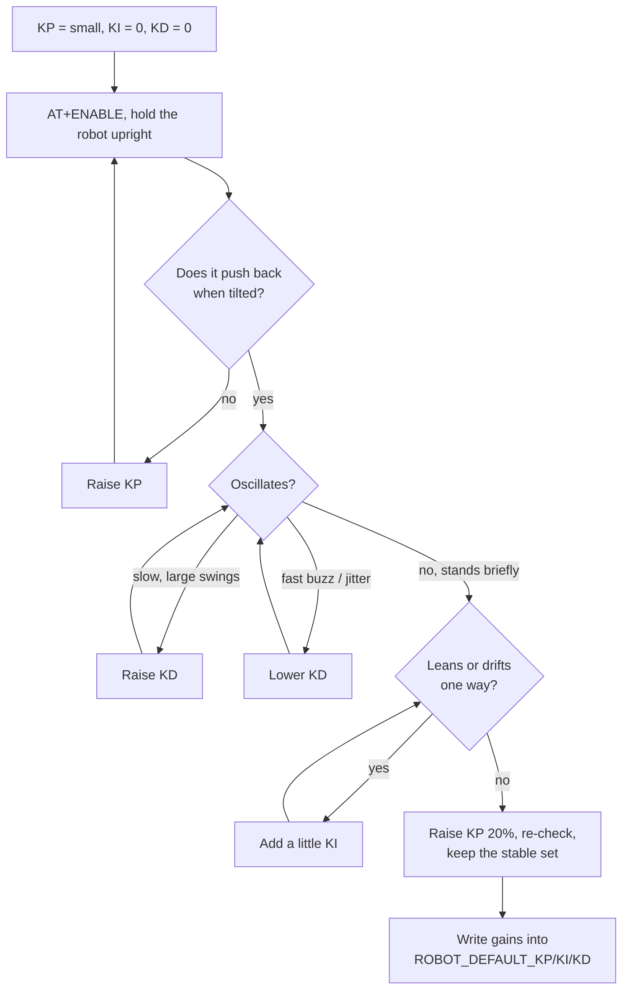

# 09 — Tuning and Experiments

A step-by-step procedure for bringing up a new robot, from sensor sign checks
to PID gains, plus a table for diagnosing misbehaviour. The theory behind each
step is in [06 — Control Theory](06-control-theory.md); the commands are in
[10 — AT Commands](10-at-commands.md).

## Where in the code

| What | Where |
|------|-------|
| Default gains | [`ROBOT_DEFAULT_KP/KI/KD`](../src/robot/robot.c#L40) |
| Gyro calibration | `GYRO_CALIBRATION_OFFSET` ([05](05-sensing-and-imu.md)) |
| Deadband, saturation, fall cut-off | [robot.c constants](../src/robot/robot.c#L45) |
| Filter choice | `ATTITUDE_FILTER` ([02](02-build-and-configuration.md#build-options)) |

## Before you start

- Charge the battery: available torque falls with voltage, so gains tuned on a
  flat battery will be too aggressive on a full one.
- Hold the robot or run it over a soft surface. `AT+STOP` cuts the motors
  immediately; keep it typed and ready.
- The robot falls back to standby by itself beyond 45° of tilt.

## Bring-up checklist

### 1. Sensor signs

```
AT+ANGLE?
```

- Upright should read close to 0°.
- Leaning **forward** (the direction the robot should drive to catch itself)
  must give a **positive** angle.

If upright is far from 0°, the IMU is mounted at an angle; if the sign is
reversed, the IMU is mounted facing the other way. Either way, fix
the board's `BOARD_TILT_*` mounting macros
([05](05-sensing-and-imu.md#axes-and-mounting)) before going further.

### 2. Gyro calibration

With the robot perfectly still:

```
AT+GYRO_X?
```

Repeat a few times. The reading should be near 0 °/s; if it sits at a
constant value, adjust `GYRO_CALIBRATION_OFFSET` by the negative of that value
and rebuild. A residual bias shows up as a steady angle error of b·τ in the
complementary filter ([07](07-sensor-fusion.md#what-gyro-bias-does)).

### 3. Motor direction

```
AT+PIDOFF
AT+ENABLE
AT+SPEED=30,30
AT+STOP
```

Both wheels must turn so the robot moves **forward** (towards a positive
angle). If one wheel turns the wrong way, swap that motor's leads. On the F407
board the forward convention per port is in
[pin-connections-f407](hardware/pin-connections-f407.md).

Then restore the PID with `AT+PIDON`.

### 4. Deadband

Increase `AT+SPEED=n,n` from 0 in small steps and note where the wheels start
turning (on the floor, not in the air). Convert to PWM (n × 2.55) and set
`MOTOR_DEADBAND` just below it.

## PID tuning procedure



1. **Start with P only.** `AT+KI=0`, `AT+KD=0`, `AT+KP=5`, `AT+ENABLE`. Raise
   KP until the robot actively pushes back when tilted. It will overshoot and
   oscillate: that is expected. This is the point where K_p exceeds gravity's
   destabilising gain ([06 §2](06-control-theory.md#2-why-pd-stabilises-it)).
2. **Add D to damp.** Raise KD in steps of 0.1 until the oscillation dies out
   within one or two swings. Stop if the motors start to buzz: that is
   derivative noise ([08](08-pid-implementation.md)).
3. **Add I sparingly.** A small KI (0.1–1) removes a constant lean. Too much
   produces slow, growing oscillations as the integral winds up.
4. **Find the margin.** Increase KP by 20 % and check it still behaves. Keep
   gains somewhat below the edge of oscillation; battery sag and floor changes
   move that edge.
5. **Persist.** `AT+SAVE` is not implemented: copy the final gains into
   `ROBOT_DEFAULT_KP/KI/KD` and rebuild.

The default gains (Kp 25, Ki 0.5, Kd 0.8) are in PWM counts per degree and
depend on motors, wheels, mass distribution and battery voltage; treat them as
a starting point, not a result.

## What to observe

| Measurement | How |
|-------------|-----|
| Filter noise and lag | `AT+STREAM=1` + [test/filter_comparison.py](../test/filter_comparison.py) ([07 §5](07-sensor-fusion.md#5-lab-compare-the-filters-on-your-robot)) |
| Balance state | `AT+STATUS?` (`BALANCED` = \|tilt\| < 5°) |
| Current gains | `AT+KP?`, `AT+KI?`, `AT+KD?` |

For tuning, the most useful signals are in the same stream: `tilt`, the PID
terms `p`, `i`, `d` and the clamped `out`
([record format](10-at-commands.md#stream-filter-data-for-testfilter_comparisonpy)).
Capture a run and plot them to see which term dominates an oscillation. The
`seq` and `drops` fields tell you whether the capture is complete. Per-wheel PWM
is not logged yet.

## Automated checks

`test/` holds a pytest suite that drives the AT console: protocol and error
codes, IMU sanity, loop rate and filter behaviour, watchdog stability, plus
opt-in motor and operator-assisted safety tests. Run it after flashing and after
every firmware change ([test/README.md](../test/README.md)).

## Symptom → cause

| Symptom | Likely cause | What to try |
|---------|--------------|-------------|
| Falls immediately in one direction, motors push the wrong way | Angle sign or motor direction reversed | Checklist steps 1 and 3 |
| Does not react until tilted a lot, then over-reacts | Deadband too large or KP too low | Measure deadband, raise KP |
| Large, slow oscillation that grows | KP too high relative to KD, or loop delay | Raise KD, check the loop is not delayed by other tasks |
| High-frequency buzz, hot motors | KD too high: derivative amplifies angle noise | Lower KD; long term use the gyro rate as D input |
| Stands but drives away steadily | CG offset + angle-only control | Small KI; real fix is a velocity loop ([06 §6](06-control-theory.md#6-cascade-control-the-next-step)) |
| Slow oscillation that builds over seconds | KI too high, integral winds up | Lower KI |
| Balances on the bench, not on the floor | Different friction/deadband, battery level | Re-measure deadband, re-tune with a charged battery |
| Worked, then the motors stop | Robot fell past 45°, or IMU samples stopped for 50 ms, and it disabled itself | `AT+STATUS?`, then `AT+ENABLE` |
| Motors stop and `AT+ANGLE?` is frozen | IMU samples stopped (I2C problem) | Check wiring/pull-ups; at start-up the IMU task retries initialisation every second |
| Board resets every ~0.5 s | Watchdog: the control task is not running its loop | Look for a deadlock or a task starving `robot_task`; build with `-DWATCHDOG_ENABLED=OFF` only to debug |
| Gains reset after power cycle | No parameter storage | Write gains into `ROBOT_DEFAULT_*` |

## Limitations and next steps

- Tuning is manual and gains are not stored.
- The stream only covers sensor fusion; control signals are not observable yet.
- Next steps: stream PID terms and PWM, add a gain-sweep script on the host,
  implement flash storage for `AT+SAVE`.
