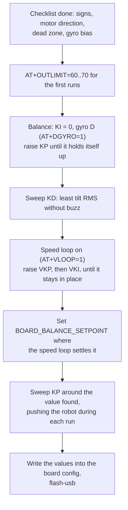

# 09 — Tuning and Experiments

A step-by-step procedure for bringing up a new robot, from sensor sign checks
to PID gains, plus a table for diagnosing misbehaviour. The theory behind each
step is in [06 — Control Theory](06-control-theory.md); the commands are in
[10 — AT Commands](10-at-commands.md).

## Where in the code

| What | Where |
|------|-------|
| Tuned defaults per robot | `BOARD_DEFAULT_KP/KI/KD`, `BOARD_BALANCE_SETPOINT`, `BOARD_SPEED_*`, `BOARD_D_FROM_GYRO` in the board config ([f407](../src/board/f407/board_config.h)); fallbacks [`ROBOT_DEFAULT_KP/KI/KD`](../src/robot/robot.c#L40) |
| Tuning tool | [test/pid_tune.py](../test/pid_tune.py): capture, analyse, sweeps, dead zone, noise |
| Gyro calibration | Automatic at power-on, `AT+GYROBIAS?` ([05](05-sensing-and-imu.md#gyro-calibration)) |
| Deadband, saturation, fall cut-off | [robot.c constants](../src/robot/robot.c#L45) |
| Filter choice | `ATTITUDE_FILTER` ([02](02-build-and-configuration.md#build-options)) |

## Before you start

- Charge the battery: available torque falls with voltage, so gains tuned on a
  flat battery will be too aggressive on a full one.
- Hold the robot or run it over a soft surface. `AT+STOP` cuts the motors
  immediately; keep it typed and ready.
- The robot falls back to standby by itself beyond 45° of tilt.

## Bring-up checklist

### 1. Sensor signs

```
AT+ANGLE?
```

- Upright should read close to 0°.
- Leaning **forward** (the direction the robot should drive to catch itself)
  must give a **positive** angle.

If upright is far from 0°, the IMU is mounted at an angle; if the sign is
reversed, the IMU is mounted facing the other way. Either way, fix
the board's `BOARD_TILT_*` mounting macros
([05](05-sensing-and-imu.md#axes-and-mounting)) before going further.

### 2. Gyro calibration

The bias is measured automatically during the first second after power-on, so
keep the robot still then. To check it, with the robot still:

```
AT+GYROBIAS?     measured bias x,y,z
AT+GYRO_X?       should read near 0 °/s
```

If `AT+GYRO_X?` is not near 0, the robot moved at power-on, or the bias has
drifted with temperature: reset or power-cycle with the robot still. A residual bias shows up as a steady angle error of b·τ in the
complementary filter ([07](07-sensor-fusion.md#what-gyro-bias-does)).

### 3. Motor direction

```
AT+PIDOFF
AT+ENABLE
AT+SPEED=30,30
AT+STOP
```

Both wheels must turn so the robot moves **forward** (towards a positive
angle), and `AT+ENC?` must count up on both. On a two-wheeled robot one motor
is mounted mirrored: set `BOARD_MOTOR1_REVERSED` or `BOARD_MOTOR2_REVERSED` in
the board config, which flips that motor's drive and its encoder together
([pin-connections-f407](hardware/pin-connections-f407.md)).

Then restore the PID with `AT+PIDON`.

### 4. Deadband

With the wheels in the air:

```sh
python3 test/pid_tune.py deadband --write
```

It measures, per wheel, where the motor starts from rest and the lowest command
that keeps it turning, applies the latter with `AT+DEADBAND`, and with `--write`
stores it in the board config (rebuild to keep it after a reset). Repeat after
replacing a motor or changing the supply ([08](08-pid-implementation.md#deadband-compensation)).

## PID tuning procedure

Two loops are tuned, inner first: the **balance PID** (tilt → motor command, every
10 ms) and the **speed loop** (encoder speed → balance setpoint, every 100 ms,
[06 §6](06-control-theory.md#6-cascade-control-the-next-step)). Every change is
live over the console; [test/pid_tune.py](../test/pid_tune.py) records each run
and reports wobble, oscillation, time at the output cap and travel.


```mermaid
flowchart TD
    PRE["Checklist done: signs, motor direction,<br/>dead zone, gyro bias"] --> CAP["AT+OUTLIMIT=60..70 for the first runs"]
    CAP --> P["Balance: KI = 0, gyro D (AT+DGYRO=1)<br/>raise KP until it holds itself up"]
    P --> D["Sweep KD: least tilt RMS without buzz"]
    D --> SP["Speed loop on (AT+VLOOP=1)<br/>raise VKP, then VKI, until it stays in place"]
    SP --> TRIM["Set BOARD_BALANCE_SETPOINT where<br/>the speed loop settles it"]
    TRIM --> KP["Sweep KP around the value found,<br/>pushing the robot during each run"]
    KP --> SAVE["Write the values into the board config,<br/>flash-usb"]
```

1. **Prepare.** Work through the checklist above. Cap the output for the first
   runs (`AT+OUTLIMIT=60`): a wrong sign or gain then falls gently instead of
   slamming the motors.
2. **Balance P and D.** `AT+KI=0`, `AT+DGYRO=1`. Raise KP until the robot holds
   itself up (rocking is fine), then sweep KD and keep the value with the least
   tilt RMS before the motors start to buzz. `pid_tune.py sweep kd 0.4 0.55 0.7`
   does the bookkeeping while the robot balances.
3. **Speed loop.** `AT+VLOOP=1`, then raise `AT+VKP` until a creep is answered by
   a lean back, and `AT+VKI` until the robot ends where it started. The balance
   PID's own KI stays 0: two integrators correcting the same offset rock the
   robot back and forth.
4. **Balance point.** The speed loop settles the setpoint where the robot's
   centre of mass actually is; copy that value into `BOARD_BALANCE_SETPOINT`, so
   the integrator starts from it instead of having to find it.
5. **Robustness.** Sweep KP once more and push the robot during each run; keep
   the setting that recovers best, not just the one that stands stillest.
6. **Persist.** `AT+SAVE` is not implemented: write the values into the board
   config and flash (`cmake --build --preset f407 --target flash-usb`).

Gains are in PWM counts per degree and depend on motors, wheels, mass and
supply voltage: retune lightly after any of them changes, starting from the
current values.

## Case study: the F407 robot

What tuning the Hiwonder board robot actually took (bench supply, October 2026),
in order. Each fix made the next problem visible.

| Step | Symptom | Cause | Fix | Result |
|------|---------|-------|-----|--------|
| 1 | Fell in 0.45 s, motors at full power | Control law pushed the wheels **away** from the lean (`error = setpoint − tilt` with forward-positive tilt and drive) | `error = tilt − setpoint` | Holds itself up briefly |
| 2 | "Aggressive", small corrections did nothing | Fixed dead zone 20 counts; the motors need 43–46 ([08](08-pid-implementation.md#deadband-compensation)) | Measured per wheel, continuous compensation | Smooth response near upright |
| 3 | Wobble that no gain set could calm | Wheel acceleration read by the accelerometer as up to 64° of tilt, in phase with the motor command: positive feedback through the filter ([07](07-sensor-fusion.md#what-wheel-acceleration-does)) | Complementary filter α 0.96 → 0.99 | 39 s up, tilt 4.6° RMS |
| 4 | Drives forward until caught | Holding a lean ahead of the balance point needs constant acceleration | Speed loop from the encoders | Net travel 18 600 → 1 500 counts in 40 s |
| 5 | Rocks back and forth | Balance KI and speed-loop KI fighting | Balance KI 0, VKI 0.1 | Tilt 1.8° RMS, never at the cap |
| 6 | Remaining wobble | D from the difference of two angle samples | D from the gyro rate | Tilt 3.1 vs 4.6° RMS, a third less motor command |
| 7 | — | Final KP sweep with pushes | KP 13, KD 0.55 | Tilt 1.1° RMS, 7 counts of travel in 10 s |

Lessons that carry over to other robots:

- **Check signs before gains.** A sign error looks like "too aggressive" and no
  amount of gain tuning fixes it ([check-mount](../test/pid_tune.py)).
- **Look at the data, not just the robot.** Correlating the accelerometer error
  with the motor command (step 3) found a problem no visual test would show.
- **Change one thing per run, and expect run-to-run noise.** A stumble or a
  loose wheel changes a 10 s run more than a 20 % gain step; repeat a surprising
  result before believing it.
- **Use the cable that does not disturb:** commands over Bluetooth, telemetry
  over USB, and firmware updates through the bootloader
  ([02](02-build-and-configuration.md#usb-c-through-our-bootloader-f407-board)).

## What to observe

| Measurement | How |
|-------------|-----|
| Everything below, in one capture | `pid_tune.py capture -s 20`, then `analyze` / `show --plot` |
| Filter noise and lag | `AT+STREAM=1` + [test/filter_comparison.py](../test/filter_comparison.py) ([07 §5](07-sensor-fusion.md#5-lab-compare-the-filters-on-your-robot)) |
| Balance state | `AT+STATUS?` (`BALANCED` = \|tilt\| < 5°) |
| Gains and loops | `AT+KP?` `AT+KI?` `AT+KD?` `AT+DGYRO?` `AT+VLOOP?` `AT+VKP?` `AT+VKI?` |
| Speed, wheels | `AT+VELOCITY?`, `AT+ENC?` |

The telemetry stream carries `tilt`, the PID terms `p`, `i`, `d`, the clamped
`out`, the speed `v` and the setpoint the balance loop actually used `spe`
([record format](10-at-commands.md#stream-filter-data-for-testfilter_comparisonpy)).
`pid_tune.py analyze` turns a capture into tilt RMS, oscillation frequency, time
at the output cap, output sign flips and the P/I/D shares, with suggestions.
`seq` and `drops` tell you whether the capture is complete.

## Automated checks

`test/` holds a pytest suite that drives the AT console: protocol and error
codes, IMU sanity, loop rate and filter behaviour, watchdog stability, plus
opt-in motor and operator-assisted safety tests. Run it after flashing and after
every firmware change ([test/README.md](../test/README.md)).

## Symptom → cause

| Symptom | Likely cause | What to try |
|---------|--------------|-------------|
| Falls immediately in one direction, motors push the wrong way | Angle sign, motor direction or control-law sign reversed | Checklist steps 1 and 3; full power away from the lean is the law's sign (case study step 1) |
| Does not react until tilted a lot, then over-reacts | Deadband too large or KP too low | Measure deadband, raise KP |
| Large, slow oscillation that grows | KP too high relative to KD, or loop delay | Raise KD, check the loop is not delayed by other tasks |
| High-frequency buzz, hot motors | KD too high, or D from the angle difference | `AT+DGYRO=1`, then lower KD |
| Wobbles whatever the gains, wild runs | The accelerometer reads wheel acceleration as tilt | Raise `AT+ALPHA` (0.99), check the error vs the motor command ([07](07-sensor-fusion.md#what-wheel-acceleration-does)) |
| Stands but drives away steadily | Balance point off, no speed feedback | `AT+VLOOP=1`, raise `AT+VKI`; set `BOARD_BALANCE_SETPOINT` where the loop settles |
| Rolls back and forth, slower than the wobble | Two integrators (balance KI and speed VKI), or VKI too high | Balance `AT+KI=0`; lower `AT+VKI` or raise `AT+VKP` |
| Slow oscillation that builds over seconds | KI or VKI too high, integral winds up | Lower it |
| Often at the output cap | Gains too high for the motors, or the cap too low | Lower KP; raise `AT+OUTLIMIT` only once the gains are calm |
| Balances on the bench, not on the floor | Different friction/deadband, battery level | Re-measure deadband, re-tune with a charged battery |
| Worked, then the motors stop | Robot fell past 45°, or IMU samples stopped for 50 ms, and it disabled itself | `AT+STATUS?`, then `AT+ENABLE` |
| Motors stop and `AT+ANGLE?` is frozen | IMU samples stopped (I2C problem) | Check wiring/pull-ups; at start-up the IMU task retries initialisation every second |
| Board resets every ~0.5 s | Watchdog: the control task is not running its loop | Look for a deadlock or a task starving `robot_task`; build with `-DWATCHDOG_ENABLED=OFF` only to debug |
| Gains reset after power cycle | No parameter storage | Write gains into `BOARD_DEFAULT_*` in the board config |

## Limitations and next steps

- Gains are not stored at run time: `AT+SAVE`/`AT+LOAD` would keep tuning
  across power cycles without a rebuild.
- The F407 robot was tuned on a bench supply; on the battery, re-measure the
  dead zone (`pid_tune.py deadband --write`) and recheck KP.
- Next: battery monitor and low-voltage cut-off, driving with `AT+VELOCITY` and
  `AT+TURN`.
